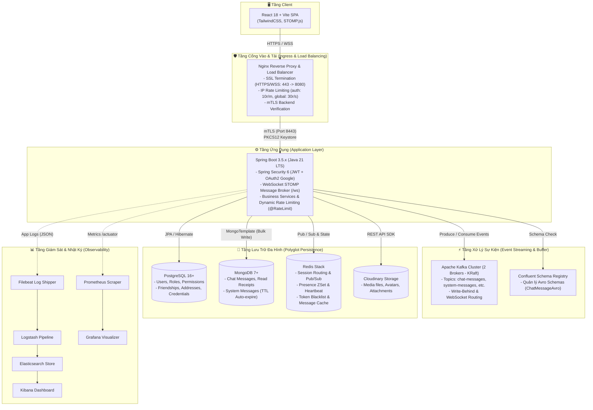

# Kiến Trúc Hệ Thống Tổng Thể (System Architecture Overview)

Tài liệu này mô tả bức tranh kiến trúc mức cao (High-Level Design - HLD) của nền tảng **ChatWeb Real-Time Messaging**. Hệ thống được xây dựng theo mô hình **Event-Driven Architecture (EDA)** kết hợp **Polyglot Persistence**, đáp ứng yêu cầu độ trễ thấp (low-latency), tính nhất quán dữ liệu, khả năng mở rộng ngang (horizontal scalability) và bảo mật nhiều lớp.

---

## 1. Sơ Đồ Kiến Trúc Hệ Thống (Architecture Topology)

Dưới đây là sơ đồ tổng thể các thành phần trong hệ sinh thái ChatWeb:



---

## 2. Phân Tích Các Tầng Thành Phần

### 2.1. Tầng Client (Frontend)
- **Công nghệ**: [React 18](file:///home/phanhuukha/Dev/ChatWeb/chatweb_fe/package.json), Vite, TailwindCSS, STOMP.js over SockJS.
- **Nhiệm vụ**:
  - Giao diện chat thời gian thực, quản lý danh bạ bạn bè, trạng thái online/offline.
  - Tích hợp thư viện mã hóa phía client (Web Crypto API) phục vụ cơ chế **End-to-End Encryption (E2EE)**: Tự sinh cặp khóa RSA, chỉ gửi Public Key lên server và mã hóa đối xứng nội dung tin nhắn trước khi truyền đi.
  - Tự động duy trì kết nối WebSocket và cơ chế Reconnect thông minh.

### 2.2. Tầng Cổng Vào (Ingress / Reverse Proxy)
- **Công nghệ**: Nginx Alpine ([nginx/nginx.conf](file:///home/phanhuukha/Dev/ChatWeb/nginx/nginx.conf)).
- **Nhiệm vụ**:
  - **Chấm dứt SSL (SSL Termination)**: Tiếp nhận lưu lượng HTTPS/WSS từ bên ngoài và chuyển tiếp nội bộ.
  - **Kiểm soát lưu lượng (IP Rate Limiting)**:
    - Vùng `auth_limit` (10 requests/phút, burst 5) áp dụng cho các API nhạy cảm (`/api/auth/`).
    - Vùng `global_limit` (30 requests/giây, burst 20) cho toàn bộ hệ thống.
  - **Bảo mật kênh truyền nội bộ qua mTLS**: Xác thực chứng chỉ số Backend (`rootCA.crt` và server certificate) khi chuyển tiếp gói tin tới [cw_backend](file:///home/phanhuukha/Dev/ChatWeb/docker-compose.yml#L207-L221).
  - **Reverse proxy định tuyến dịch vụ giám sát**: Cung cấp đường dẫn truy cập Kibana (`/kibana/`) và Grafana (`/grafana/`).

### 2.3. Tầng Ứng Dụng (Application Layer)
- **Công nghệ**: Spring Boot 3.5.x, Java 21 LTS ([chatweb_be](file:///home/phanhuukha/Dev/ChatWeb/chatweb_be)).
- **Nhiệm vụ**:
  - **Xác thực & Ủy quyền**: Spring Security 6 với JWT kép (Access Token ngắn hạn + Refresh Token dài hạn lưu trong HttpOnly Cookie), hỗ trợ Single Sign-On qua Google OAuth2.
  - **Quản lý phiên bản Token (Token Versioning)**: Thu hồi quyền truy cập tức thì trên toàn bộ thiết bị khi người dùng đổi mật khẩu hoặc đăng xuất từ xa.
  - **WebSocket Message Broker**: Xử lý handshake xác thực token, quản lý phiên kết nối STOMP.
  - **Định tuyến tin nhắn phân tán**: Điều phối tin nhắn giữa các node Backend thông qua Redis Hash và Redis Pub/Sub.

### 2.4. Tầng Xử Lý Sự Kiện (Event Streaming Layer)
- **Công nghệ**: Apache Kafka (2 Brokers chạy chế độ KRaft) + Confluent Schema Registry.
- **Nhiệm vụ**:
  - **Khử ghép nối (Decoupling)**: Phân tách luồng nhận tin từ người gửi và luồng lưu trữ xuống cơ sở dữ liệu.
  - **Chống mất mát dữ liệu**: Cho phép hệ thống tiếp nhận lượng tin nhắn cực lớn trong giờ cao điểm mà không gây sập cơ sở dữ liệu (Buffer).
  - **Đảm bảo tính tương thích (Schema Evolution)**: Sử dụng Apache Avro ([ChatMessageAvro.avsc](file:///home/phanhuukha/Dev/ChatWeb/chatweb_be/src/main/resources/avro/ChatMessageAvro.avsc)) để định dạng nhị phân nhỏ gọn và kiểm soát chặt chẽ các phiên bản payload.

### 2.5. Tầng Lưu Trữ Đa Dạng (Polyglot Persistence)
Hệ thống sử dụng nguyên lý *"chọn đúng công cụ cho đúng bài toán"*:
1. **PostgreSQL**: Dữ liệu quan hệ chặt chẽ, cần toàn vẹn ACID (Người dùng, mật khẩu đã mã hóa BCrypt, quyền hạn RBAC, quan hệ kết bạn, khóa RSA).
2. **MongoDB**: Dữ liệu tin nhắn chat dạng tài liệu phi cấu trúc, tốc độ ghi lớn, hỗ trợ phân trang thời gian mượt mà, và tự động thu hồi tin nhắn hệ thống hết hạn bằng **TTL Index**.
3. **Redis**: Bộ nhớ đệm tốc độ microsecond, lưu danh sách user online (ZSet), bộ đếm phiên kết nối (Hash), khóa phân tán chống gửi trùng lặp (Dedup SETNX), và kênh pub/sub liên node.
4. **Cloudinary**: Dịch vụ lưu trữ đám mây cho hình ảnh đại diện và file đính kèm trong tin nhắn chat.

### 2.6. Tầng Giám Sát & Nhật Ký (Observability)
- **ELK Stack**: Filebeat đọc file log định dạng JSON cấu trúc từ thư mục [chatweb_be/logs](file:///home/phanhuukha/Dev/ChatWeb/chatweb_be/logs), chuyển qua Logstash để lọc/chuẩn hóa rồi lưu trữ vào Elasticsearch, hiển thị tập trung trên Kibana.
- **Prometheus & Grafana**: Thu thập metrics định kỳ từ `/actuator/prometheus` (CPU, JVM heap, Kafka consumer lag, số lượng kết nối STOMP) và hiển thị trực quan qua [grafana-dashboard.json](file:///home/phanhuukha/Dev/ChatWeb/chatweb_be/grafana-dashboard.json).

---

## 3. Kiến Trúc Mạng & Bảo Mật (Network Security Architecture)

```
[ Internet ]
     │
     ▼ (HTTPS / WSS)
[ Nginx Load Balancer (Port 80/443) ]
     │
     │  ◄─── mTLS (Bảo vệ Certificate xác thực 2 chiều)
     ▼       Port 8443 (PKCS12 Keystore)
[ Spring Boot Service (cw_backend) ]
     │
     ├─────► [ Redis (Port 6379) - Password Protected ]
     ├─────► [ Kafka Brokers (Port 9092) - Internal Docker Network ]
     ├─────► [ PostgreSQL (Port 5432) - Isolated Network ]
     └─────► [ MongoDB (Port 27017) - Isolated Network ]
```

- **Nguyên tắc cô lập**: Tất cả các database (Postgres, Mongo, Redis) và Kafka brokers chỉ mở cổng trong mạng nội bộ Docker (`chatweb_default`). Chỉ Nginx công khai cổng ra bên ngoài.
- **Mã hóa kênh truyền nội bộ**: Giữa Nginx và Spring Boot backend sử dụng kết nối TLS bảo mật qua chứng chỉ tự ký sinh bởi CA riêng ([ssl/ca/rootCA.crt](file:///home/phanhuukha/Dev/ChatWeb/ssl/ca/rootCA.crt)).
