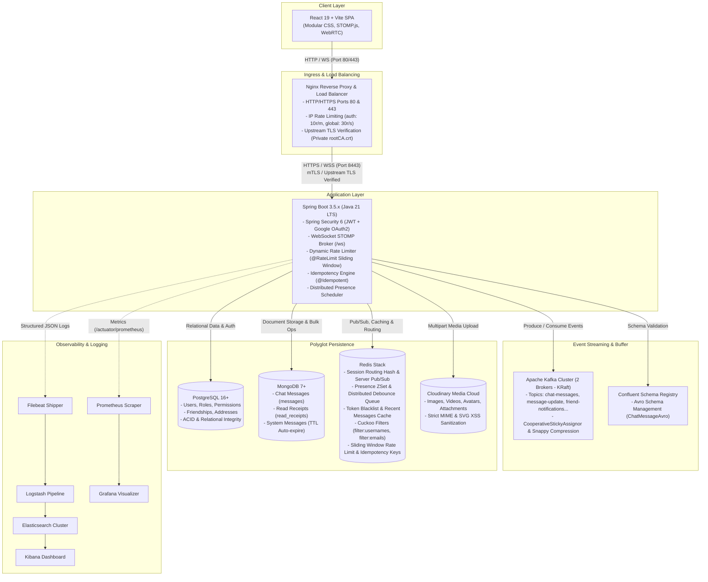

# System Architecture Overview

This document describes the high-level design (HLD) of the **ChatWeb Real-Time Messaging Platform**. The system is built around an **Event-Driven Architecture (EDA)** coupled with a **Polyglot Persistence** model to achieve ultra-low latency, robust data consistency, horizontal scalability, and defense-in-depth security.

---

## 1. High-Level Architecture Topology

The diagram below illustrates the end-to-end component topology and interactions within the ChatWeb ecosystem:

---

## 2. Core Architectural Tiers

### 2.1. Client Tier (Frontend Application)
- **Technology Stack**: React 19, Vite 8, React Router DOM 7, STOMP.js (`@stomp/stompjs`), SockJS client.
- **Styling Architecture**: Modular CSS isolating scope across domains (`auth.css`, `chat.css`, `admin.css`), minimizing payload size while maintaining design consistency.
- **Dual Communication Channels**:
  - **REST API Client (`apiClient.js`)**: Executes HTTP requests for authentication, profile updates, conversation history queries, and media uploads. Automatically attaches the `X-Idempotency-Key` header for state-modifying operations.
  - **WebSocket Client (`useChatSocket.js`)**: Maintains a persistent, bi-directional full-duplex connection via STOMP over SockJS, featuring automatic reconnection, subscription resumption, and 10-second heartbeats.
  - **WebRTC Peer-to-Peer Subsystem (`useWebRTC.js`)**: Facilitates real-time audio and video peer-to-peer calls directly between clients, using WebSocket STOMP for signaling exchange.

### 2.2. Ingress & Reverse Proxy Tier (Nginx)
- Serves as the single unified entry point into the system from external networks, listening on ports `80` (HTTP) and `443` (HTTPS).
- **Network-Level Rate Limiting**:
  - **Authentication Zone**: Enforces a strict limit of 10 requests/minute (burst 5) on `/api/auth/` routes to mitigate credential stuffing and brute-force attacks.
  - **Global Zone**: Enforces 30 requests/second (burst 20) across general API and static asset traffic.
- **Upstream TLS Verification**:
  - Nginx proxies internal traffic to the backend instances over HTTPS on port `8443`.
  - Enforces `proxy_ssl_verify on` and validates backend certificates against the internal Private Root Certificate Authority (`rootCA.crt`).

### 2.3. Application Tier (Spring Boot Application)
- Powered by **Java 21 LTS** and **Spring Boot 3.5.x**.
- Structured following enterprise clean layered architecture: `Controller` $\rightarrow$ `Service` $\rightarrow$ `Repository` $\rightarrow$ `Model / DTO`.
- **Defensive Engineering & Protection**:
  - **Redis Cuckoo Filter Preflight**: Intercepts authentication and registration requests to test existence in $O(1)$ time in memory prior to querying PostgreSQL.
  - **Sliding Window Rate Limiter**: Method-level rate-limiting via `@RateLimit` backed by custom Redis Lua scripts.
  - **Idempotency Engine**: `@Idempotent` aspect backed by Redis distributed locks, eliminating duplicate execution caused by client network timeouts and retries.
  - **Distributed Presence Debounce**: Queues disconnected sessions into a Redis Sorted Set (`presence:offline_queue`) with a 5-second deadline, suppressing connection flapping during page reloads.

### 2.4. Event Streaming Tier (Apache Kafka)
- 2-broker Kafka cluster operating in **KRaft (Kafka Raft Metadata)** mode, eliminating external ZooKeeper dependencies.
- Integrated with **Confluent Schema Registry** to enforce binary **Apache Avro** schemas on critical real-time topics (`chat-messages`).
- **Asynchronous Dual-Consumer Separation**:
  - **Fast-Push Consumer Group** (`chat-websocket-group`): Prioritizes sub-10ms delivery to online recipients over WebSocket.
  - **Write-Behind Batch Consumer Group** (`chat-save-group`): Batches messages for bulk persistence into MongoDB, shielding the primary database from write spikes.
  - **Dead Letter Topic (DLT)** (`chat-messages-save-dlt`): Isolates unrecoverable persistence failures for automated or manual remediation without blocking event flow.

### 2.5. Polyglot Persistence Tier
ChatWeb employs specialized data stores matched to specific storage characteristics:
1. **PostgreSQL 16+**: Authoritative relational data requiring strict ACID guarantees and foreign key constraints (`users`, `roles`, `permissions`, `friendships`, `addresses`).
2. **MongoDB 7+**: High-throughput document store with compound indexing and TTL support (`messages`, `read_receipts`, `system_message`).
3. **Redis Stack**: High-speed in-memory data structures, WebSocket multi-node routing tables, Cuckoo Filters, sliding-window logs, token blacklists, and distributed debounce queues.
4. **Cloudinary**: Cloud-based object storage for media files and avatars, with strict MIME validation rejecting vulnerable formats (e.g., SVG XSS vectors).

### 2.6. Observability & Telemetry Tier
- **ELK Stack (Elasticsearch, Logstash, Kibana, Filebeat)**:
  - Backend writes machine-readable structured JSON logs to mounted disk volumes.
  - Filebeat tails log streams and ships them to Logstash for filtering, normalization, and indexing into Elasticsearch.
  - Kibana provides centralized visualization dashboards for auditing, error tracing, and operational analytics.
- **Prometheus & Grafana**:
  - Spring Boot Actuator exports Prometheus metrics at `/actuator/prometheus`.
  - Prometheus scrapes JVM statistics, HTTP request latencies, Kafka consumer lag, and database connection pools.
  - Grafana renders real-time telemetry dashboards and health alerts.
