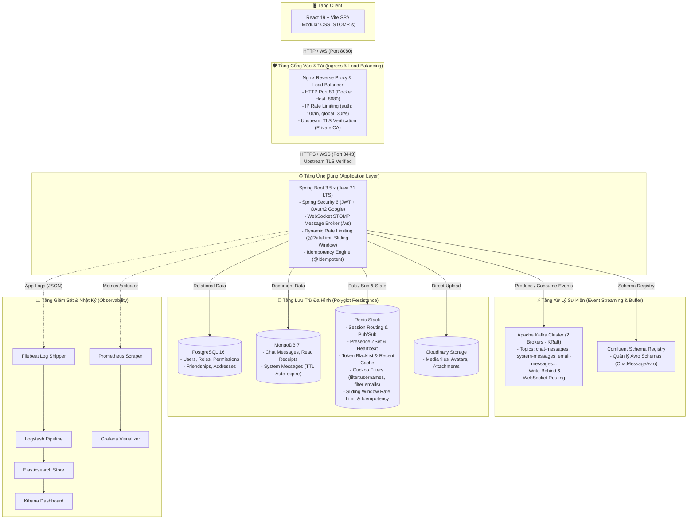

# Kiến Trúc Hệ Thống Tổng Thể (System Architecture Overview)

Tài liệu này mô tả bức tranh kiến trúc mức cao (High-Level Design - HLD) của nền tảng **ChatWeb Real-Time Messaging**. Hệ thống được xây dựng theo mô hình **Event-Driven Architecture (EDA)** kết hợp **Polyglot Persistence**, đáp ứng yêu cầu độ trễ thấp (low-latency), tính nhất quán dữ liệu, khả năng mở rộng ngang (horizontal scalability) và bảo mật nhiều lớp.

---

## 1. Sơ Đồ Kiến Trúc Hệ Thống (Architecture Topology)

Dưới đây là sơ đồ tổng thể các thành phần trong hệ sinh thái ChatWeb:

---

## 2. Chi Tiết Các Phân Tầng Cốt Lõi

### 2.1. Tầng Client (Frontend Application)
- **Công nghệ**: [React 19](file:///home/phanhuukha/Dev/ChatWeb/chatweb_fe/package.json), Vite 8, React Router DOM 7, STOMP.js.
- **Phong cách giao diện**: Kiến trúc CSS Module theo từng phân hệ (`auth.css`, `chat.css`, `admin.css`), tối ưu dung lượng tải và độ tương thích trình duyệt.
- **Giao tiếp kép**:
  - **REST Client (`apiClient.js`)**: Thực hiện các yêu cầu HTTP xác thực, quản lý profile, lịch sử tin nhắn và tải media. Tự động đính kèm `X-Idempotency-Key` với các tác vụ nhạy cảm.
  - **WebSocket Client (`useChatSocket.js`)**: Duy trì kết nối hai chiều thời gian thực qua SockJS/STOMP, tự động reconnect và heartbeat định kỳ (10s).

### 2.2. Tầng Cổng Vào & Tải (Ingress & Reverse Proxy)
- Điểm tiếp nhận lưu lượng duy nhất của toàn bộ hệ thống từ bên ngoài.
- **Rate Limiting tầng mạng**: 
  - Vùng bảo vệ xác thực: Tối đa 10 requests/phút (burst 5) cho các endpoint `/api/auth/`.
  - Vùng toàn cục: Tối đa 30 requests/giây (burst 20) cho các endpoint khác.
- **Bảo mật kết nối nội bộ**: Nginx kết nối ngược tới Spring Boot qua cổng an toàn `8443` (HTTPS) và kiểm tra tính hợp lệ của chứng chỉ thông qua chứng chỉ gốc nội bộ `rootCA.crt` (`proxy_ssl_verify on`).

### 2.3. Tầng Ứng Dụng (Spring Boot Application)
- Trung tâm điều phối nghiệp vụ backend viết trên **Java 21 LTS** và **Spring Boot 3.5.x**.
- **Kiến trúc phân lớp chuẩn mực**: `Controller` $\rightarrow$ `Service` $\rightarrow$ `Repository` $\rightarrow$ `Model / DTO`.
- **Bảo vệ chống tấn công & quá tải**:
  - Tích hợp `@RateLimit` theo thuật toán Sliding Window Log (lưu tại Redis).
  - Tích hợp `@Idempotent` dựa trên header `X-Idempotency-Key` để bảo đảm tính an toàn khi client retry.
  - Kiểm tra tức thì sự tồn tại của tài khoản thông qua **Redis Cuckoo Filter** trước khi truy vấn PostgreSQL.

### 2.4. Tầng Xử Lý Sự Kiện (Event Streaming Layer)
- Cụm Kafka gồm **2 Brokers chạy chế độ KRaft** kết hợp **Confluent Schema Registry**.
- Đảm bảo luồng xử lý bất đồng bộ không gây nghẽn:
  - Tách luồng đẩy tin nhắn nhanh cho WebSocket (`ChatConsumer`) và luồng ghi MongoDB theo lô (`DatabaseWriteBehindConsumer`).
  - Phục vụ worker gửi email xác thực OTP ngầm mà không làm chậm API đăng ký.

### 2.5. Tầng Lưu Trữ Đa Dạng (Polyglot Persistence)
Hệ thống không phụ thuộc vào một cơ sở dữ liệu duy nhất mà phân công chuyên biệt theo bản chất dữ liệu:
1. **PostgreSQL**: Lưu trữ dữ liệu quan hệ có cấu trúc khắt khe (Users, Roles, Permissions, Friendships, Addresses).
2. **MongoDB**: Lưu trữ dữ liệu phi cấu trúc, tốc độ ghi cao (Messages, Read Receipts, System Messages).
3. **Redis Stack**: Duy trì trạng thái in-memory, session routing WebSocket, bộ lọc Cuckoo Filter, hàng đợi Sliding Window và Cache.

### 2.6. Tầng Giám Sát & Nhật Ký (Observability Layer)
- **ELK Stack**: Filebeat đọc file log định dạng JSON từ backend, chuyển tới Logstash để chuẩn hóa, lưu trữ tại Elasticsearch và hiển thị qua Kibana.
- **Prometheus & Grafana**: Prometheus định kỳ cào chỉ số hoạt động từ Spring Actuator (`/actuator/prometheus`) và biểu diễn qua bảng điều khiển Grafana.
