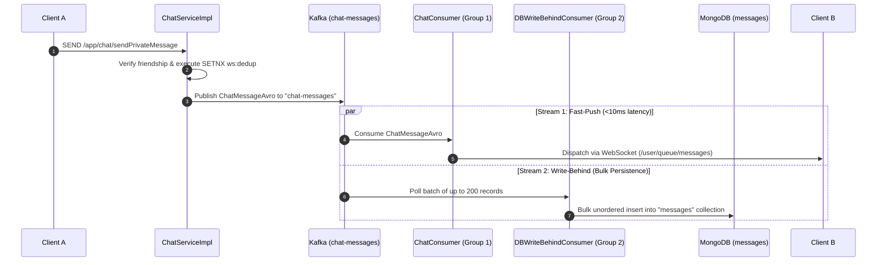
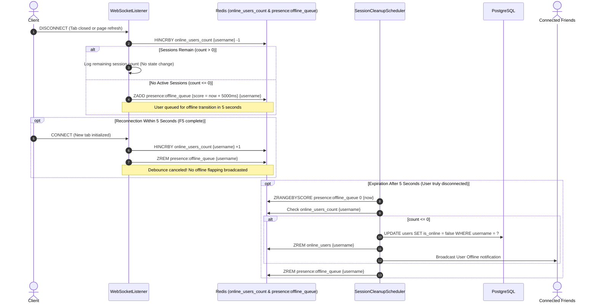

# Architecture Decision Records (ADR)

This document captures the critical architectural and design decisions made throughout the lifecycle of the **ChatWeb** platform, detailing the context, decisions, rationale, trade-offs, and verification mechanisms for each choice.

---

## ADR-01: Polyglot Persistence Strategy

### Context
A real-time communication platform handles diverse data structures with opposing performance and integrity characteristics:
- **Relational & Auth Data**: User credentials, role-based permissions (RBAC), friend relationships, and addresses demand strict ACID guarantees, uniqueness constraints, and foreign key integrity.
- **Message Data**: Chat messages and reactions generate high-frequency writes, flexible payload formats (text, media URLs, metadata), and require cursor-based pagination and automated retention policies.
- **Ephemeral State & Cache**: Active WebSocket routing sessions, online presence, rate-limiting windows, idempotency locks, and token revocation blacklists require sub-millisecond in-memory lookups.

A single unified database would either suffer from relational I/O bottlenecks during peak messaging traffic or compromise relational consistency.

### Decision
Adopt a **Polyglot Persistence** architecture partitioning storage across three purpose-built engines:
1. **PostgreSQL 16+**: Authoritative storage for `users`, `roles`, `permissions`, `role_has_permission`, `friendships`, and `addresses`.
2. **MongoDB 7+**: Document store for `messages`, `read_receipts`, and `system_message`.
3. **Redis Stack**: In-memory key-value and data structure store managing distributed session routing, Cuckoo Filters, sliding-window rate limit logs, presence sets, and transient tokens.

### Trade-offs
- **Advantages**: Peak throughput and optimal storage models for each workload; high message write volume does not degrade user authentication or friendship queries.
- **Disadvantages**: System complexity increases with three database technologies to operate and monitor; cross-database transactions cannot be executed atomically; eventual consistency is maintained asynchronously via Kafka event streaming.

---

## ADR-02: Decoupled Real-Time Push and Persistence via Kafka Dual Consumer Groups

### Context
When User A transmits a private message to User B:
- If the backend synchronously persists the message to MongoDB before pushing it over WebSocket, end-to-end message latency is directly tied to database disk write performance. Database contention or slow I/O blocks user-perceived delivery.
- If the backend pushes the message over WebSocket directly without durable buffering, database outages or write spikes can lead to silent message loss.

### Decision
Implement the **Write-Behind Pattern** using **Apache Kafka** with **Dual Competing Consumer Groups** listening to the `chat-messages` topic:



1. **Fast-Push Stream (`chat-websocket-group`)**:
   - Single-record consumption configured with `concurrency = 4` and `@RetryableTopic` backoff (5 attempts, 200ms delay).
   - Resolves target server node and pushes the frame immediately to the recipient over WebSocket.
2. **Write-Behind Stream (`chat-save-group`)**:
   - Batch consumption configured with `concurrency = 2`, polling up to 200 messages per batch with a 500ms max fetch wait.
   - Executes non-blocking unordered bulk inserts into MongoDB via `bulkOps.insert()`.
   - Permanent failures after 4 retries are forwarded to the Dead Letter Topic (`chat-messages-save-dlt`).

### Trade-offs
- **Advantages**: Sub-10ms delivery to online users; MongoDB is insulated from traffic spikes by Kafka's durable disk-backed buffer; bulk database writes minimize network round trips and indexing overhead.
- **Disadvantages**: In extreme scenarios where MongoDB crashes simultaneously with a broker disruption, a message might appear on the recipient's screen briefly before being permanently committed to disk (mitigated by the DLT rescue consumer).

---

## ADR-03: Multi-Node WebSocket Session Routing via Redis Hash & Server Pub/Sub

### Context
In a clustered backend environment behind a load balancer, WebSocket connections are persistent and stateful. User A might be connected to `Server-1`, while User B is connected to `Server-2`. When User A sends a message to User B, `Server-1` cannot directly access the WebSocket session maintained in `Server-2`'s memory.

### Decision
Implement a distributed routing fabric using **Redis Hash** and **Redis Pub/Sub**:
1. **Session-to-Server Mapping**:
   - Upon connection, each backend node identifies itself with a unique `ServerIdentity.SERVER_ID` (generated or host-derived).
   - The user's active node mapping is recorded in Redis Hash `ws:routing:servers:{username}`.
2. **Targeted Dispatching (`WebSocketRoutingService`)**:
   - When a message must be sent to a user, the service inspects `ws:routing:servers:{username}`:
     - **Local Delivery**: If the user holds active sessions on the current node, the frame is dispatched directly to the local session.
     - **Cross-Node Delivery**: If the user is connected to a different node, the message is encapsulated in a `RedisWsMessage` and published to `channel:server:{targetServerId}`.
     - The target node, which subscribes exclusively to its own server channel, receives the payload and delivers it to the connected client.

### Trade-offs
- **Advantages**: Enables horizontal scaling of backend WebSocket servers without sticky sessions; avoids broadcasting messages to all servers in the cluster (zero broadcast storm).
- **Disadvantages**: Introduces a minor Redis Pub/Sub network hop for cross-server message deliveries.

---

## ADR-04: Two-Tier Rate Limiting Strategy

### Context
A public-facing chat application is vulnerable to automated credential brute-forcing, message flooding, and denial-of-service (DoS) attacks. Relying solely on application-level checks wastes JVM threads and CPU cycles on illegitimate requests, while relying solely on IP-level ingress limits fails to distinguish between legitimate users sharing a NAT/proxy network.

### Decision
Deploy a complementary **Two-Tier Rate Limiting Architecture**:

| Tier | Enforcement Point | Strategy & Rules | Target Protection |
| :--- | :--- | :--- | :--- |
| **Tier 1: Ingress** | Nginx (`ngx_http_limit_req_module`) | - Auth Zone: `10r/m` (burst 5)<br/>- Global Zone: `30r/s` (burst 20) | Drops volumetric attacks at the edge before consuming backend compute resources. |
| **Tier 2: Application** | Spring Boot (`@RateLimit` Aspect + Redis Lua) | Sliding Window Log algorithm executed atomically in Redis | Fine-grained limits scoped by authenticated `username` or client IP. |

The application tier executes a custom Redis Lua script implementing the Sliding Window Log algorithm:
1. Removes expired request timestamps using `ZREMRANGEBYSCORE`.
2. Computes the count of requests within the active window using `ZCARD`.
3. If under the limit, records the current epoch timestamp with `ZADD` and permits the request.
4. If over the limit, rejects the request immediately with HTTP 429 Too Many Requests.

---

## ADR-05: Multi-Tier Idempotency & Message Deduplication Engine

### Context
In unstable mobile networks or high-latency environments, clients frequently retry requests when an acknowledgment (ACK) is delayed or temporarily dropped. Without idempotency guardrails, retried requests cause duplicated chat messages, duplicate friend requests, and repeated file uploads to cloud storage.

### Decision
Implement end-to-end deduplication across REST, WebSocket, and Database tiers:
1. **REST API Idempotency (`@Idempotent`)**:
   - Applied to state-mutating endpoints (file upload, friend request accept).
   - Clients supply an `X-Idempotency-Key: <UUID>` header.
   - `IdempotentAspect` attempts to acquire a distributed Redis lock with key `idempotent:{methodKey}:{idempotencyKey}` (TTL 300–600s). Duplicate invocations within the TTL window are rejected with a conflict error.
2. **WebSocket STOMP Deduplication (`ws:dedup`)**:
   - Clients generate a unique client-side `localId` (UUID v4) for every message draft.
   - Upon receiving a `/app/chat/sendPrivateMessage` frame, the backend attempts `SETNX ws:dedup:{sender}:{localId}` with a 300-second TTL.
   - If the key already exists, the server silently acknowledges the message without publishing duplicate events to Kafka or dispatching duplicate alerts to the recipient.
3. **Database Bulk Insert Deduplication**:
   - MongoDB unique index constraints handle edge cases during Write-Behind batch processing.
   - `DatabaseWriteBehindConsumer` catches `DuplicateKeyException` during unordered bulk operations, safely acknowledging duplicated records without failing the entire batch.

---

## ADR-06: Distributed 5-Second Presence Debounce Queue via Redis Sorted Set

### Context
When a user refreshes a browser tab (F5) or experiences momentary Wi-Fi/cellular handoff, their WebSocket session disconnects and immediately reconnects within 1 to 2 seconds. If the backend immediately transitions the user's status to `is_online = false` and broadcasts an offline alert to their friend list, friends' clients experience rapid "presence flapping" (online $\rightarrow$ offline $\rightarrow$ online).

### Decision
Implement a **Distributed Presence Debounce Queue** backed by Redis:



1. **Distributed Tracking**:
   - Tab counts are tracked in Redis Hash `online_users_count`.
   - When a session disconnects and the remaining count is $\le 0$, the username is scheduled in the Redis Sorted Set `presence:offline_queue` with a score of `currentTimeMillis + 5000`.
2. **Reconnection Cancellation**:
   - If a new `CONNECT` event occurs for the user while in the queue, `WebSocketListener` removes the user from `presence:offline_queue` immediately with `ZREM`.
3. **Clustered Cleanup**:
   - `SessionCleanupScheduler` runs periodically, querying `presence:offline_queue` for records where `score <= now`.
   - If `online_users_count` remains $\le 0$, it marks `is_online = false` in PostgreSQL, purges the user from `online_users`, and broadcasts an offline presence event to friends.

### Trade-offs
- **Advantages**: Eliminates presence flapping across tab switches and page refreshes; fully cluster-safe because state resides in Redis Sorted Sets rather than in-memory JVM thread schedulers.
- **Disadvantages**: Offline status propagation is intentionally delayed by 5 seconds when a user closes their browser window.

---

## ADR-07: Redis Cuckoo Filter for Sub-Millisecond Credential Preflight & Anti-Enumeration

### Context
During authentication and user registration:
- Attackers frequently probe endpoints with millions of non-existent usernames and emails to brute-force accounts or enumerate valid users.
- Querying PostgreSQL on every invalid login or registration request exhausts database connection pool threads and drives disk I/O.
- Standard Bloom Filters do not support item deletion, making them unsuitable when users update their registered email addresses or delete accounts.

### Decision
Deploy **Redis Cuckoo Filters** via Redis Stack commands (`CF.EXISTS`, `CF.ADD`, `CF.DEL`):
1. **Filter Keys**:
   - `filter:usernames`: Holds all registered usernames.
   - `filter:emails`: Holds all registered email addresses.
2. **Preflight Authentication Guard**:
   - During `login`, `AuthenticationServiceImpl` invokes `cuckooFilterService.exists("filter:usernames", username)`.
   - If the filter returns `false`, the username is guaranteed not to exist (zero false negatives). The request is rejected immediately with HTTP 404/401 without executing a query against PostgreSQL.
3. **Registration Availability Preflight**:
   - During `register`, the filter checks username and email presence in memory before executing database validation.
4. **Dynamic Mutation Support**:
   - When users complete account verification, items are added via `CF.ADD`.
   - When users update their email (`UserServiceImpl`), the old email is removed via `CF.DEL` and the new email is inserted via `CF.ADD`.

### Trade-offs
- **Advantages**: In-memory sub-millisecond rejection of invalid credentials; protects relational database connection pool from credential stuffing attacks; supports element deletion.
- **Disadvantages**: Requires Redis Stack with the RedisBloom module enabled; filter capacity must be sized appropriately to keep false positive rates below 1%.

---

## ADR-08: Watermark-Based Read Receipts with MongoDB `$max` Upsert & Real-Time Fanout

### Context
In high-volume chat conversations, marking messages as read by issuing an `UPDATE` on every individual message document causes severe write amplification. When a user opens a conversation with 50 unread messages, updating 50 individual documents creates locking overhead and heavy disk I/O.

### Decision
Implement a **Watermark-Based Read Receipt Architecture**:
1. **Single Read Watermark Document**:
   - Instead of updating individual messages, each user maintains a single read receipt record per conversation in the `read_receipts` collection.
   - Document ID: `{conversationId}:{username}`.
   - Fields: `conversationId`, `username`, `lastReadTimestamp`.
2. **Monotonic Watermark Upsert**:
   - When a user reads a conversation, the backend executes an atomic MongoDB upsert:
     ```javascript
     Query: { _id: "alice_bob:bob" }
     Update: {
       $max: { lastReadTimestamp: ISODate("...") },
       $setOnInsert: { conversationId: "alice_bob", username: "bob" }
     }
     ```
   - Using `$max` guarantees that out-of-order client requests never regress the read watermark.
3. **Cache Invalidation & Real-Time Fanout**:
   - Writes the latest watermark to Redis key `read:receipt:{convId}:{username}` with a 7-day TTL.
   - Evicts cached unread counts from `unread:counts:{username}`.
   - Publishes a `ReadReceiptResponse` domain event to the `message-update` Kafka topic.
   - `UpdateMessageConsumer` processes the event and delivers a real-time read receipt notification to the message sender via `/user/queue/notifications`.

### Trade-offs
- **Advantages**: Compresses read status tracking into a single $O(1)$ atomic upsert per read event regardless of how many messages were consumed; eliminates bulk document updates in MongoDB; guarantees monotonicity.
- **Disadvantages**: Determining whether an older individual message was read requires comparing its timestamp against the user's read watermark (`message.timestamp <= receipt.lastReadTimestamp`).
