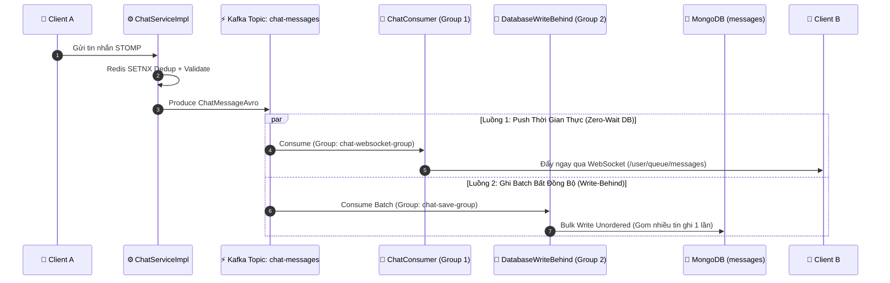

# Quyết Định Kiến Trúc (Architecture Decision Records - ADR)

Tài liệu này ghi lại các quyết định thiết kế quan trọng nhất trong hệ thống ChatWeb, lý do lựa chọn (rationale), các giải pháp thay thế đã được cân nhắc, và sự đánh đổi (trade-offs).

---

## ADR-01: Sử Dụng Mô Hình Lưu Trữ Đa Dạng (Polyglot Persistence)

### Ngữ cảnh
Một ứng dụng nhắn tin thời gian thực vừa có các dữ liệu quan hệ chặt chẽ (tài khoản, bạn bè, phân quyền), vừa có dữ liệu tin nhắn phi cấu trúc với tần suất ghi cực lớn, vừa đòi hỏi các cấu trúc dữ liệu in-memory tốc độ cao cho phiên kết nối và trạng thái online/offline. Nếu chỉ dùng 1 loại cơ sở dữ liệu duy nhất (ví dụ chỉ PostgreSQL hoặc chỉ MongoDB), hệ thống sẽ gặp các nút thắt cổ chai về I/O hoặc vi phạm tính toàn vẹn dữ liệu.

### Quyết định
Chia tách cơ sở dữ liệu thành 3 tầng chuyên biệt:
1. **PostgreSQL**:
   - Lưu trữ: `users`, `roles`, `permissions`, `friendships`, `addresses`.
   - Lý do: Yêu cầu tính toàn vẹn quan hệ (Foreign Keys, Constraints), bảo đảm tính nhất quán nghiêm ngặt (ACID) cho luồng tiền tệ/xác thực/kết bạn.
2. **MongoDB**:
   - Lưu trữ: `messages` ([ChatMessage](file:///home/phanhuukha/Dev/ChatWeb/chatweb_be/src/main/java/com/web/backend/model/mongodb/ChatMessage.java)), `read_receipts`, `system_message`.
   - Lý do: Dữ liệu tin nhắn tăng trưởng theo hàm mũ, kích thước linh hoạt (văn bản, emoji, fileUrl, reactions map, khóa mã hóa E2EE). MongoDB hỗ trợ ghi hàng loạt (bulk write) cực nhanh và có tính năng TTL Index tự hủy tin nhắn hệ thống.
3. **Redis**:
   - Lưu trữ: Trạng thái presence, bộ đếm session, caching tin nhắn gần nhất, blacklist token, rate limiting.
   - Lý do: Tốc độ phản hồi microsecond, cung cấp sẵn các cấu trúc dữ liệu mạnh mẽ (Sorted Set, Hash, String bitwise).

### Đánh đổi (Trade-offs)
- **Ưu điểm**: Tối ưu hiệu năng tối đa cho từng nghiệp vụ; không bị nghẽn I/O giữa tác vụ đọc tài khoản và tác vụ ghi hàng triệu tin nhắn chat.
- **Nhược điểm**: Phải quản lý nhiều engine cơ sở dữ liệu, không thể dùng Transaction phân tán (Distributed Transaction) trực tiếp giữa Postgres và Mongo (khắc phục bằng Eventual Consistency qua Kafka).

---

## ADR-02: Phân Tách Luồng Đẩy Tin Nhắn và Ghi Database Qua Kafka (Dual Consumer Groups)

### Ngữ cảnh
Khi người dùng A gửi tin nhắn cho người dùng B:
- Nếu Backend thực hiện ghi vào database trước rồi mới gửi WebSocket: Độ trễ giao tiếp sẽ phụ thuộc vào tốc độ ghi ổ cứng của database. Khi có hàng chục nghìn người cùng nhắn tin, DB nghẽn I/O sẽ khiến tin nhắn hiển thị rất chậm.
- Nếu Backend chỉ gửi WebSocket mà không có cơ chế đệm tin: Khi DB tạm thời quá tải hoặc restart, tin nhắn sẽ bị mất vĩnh viễn.

### Quyết định
Áp dụng mô hình **Write-Behind** kết hợp **Competing Consumer Groups** trên cùng một topic Kafka (`chat-messages`):

1. **Consumer Group 1 (`chat-websocket-group`)**: 
   - [ChatConsumer.java](file:///home/phanhuukha/Dev/ChatWeb/chatweb_be/src/main/java/com/web/backend/kafka/consumer/ChatConsumer.java) ngay lập tức chuyển đổi Avro sang DTO và chuyển tiếp qua [WebSocketRoutingService](file:///home/phanhuukha/Dev/ChatWeb/chatweb_be/src/main/java/com/web/backend/service/WebSocketRoutingService.java) tới người nhận. Hoàn toàn không đợi MongoDB.
2. **Consumer Group 2 (`chat-save-group`)**:
   - [DatabaseWriteBehindConsumer.java](file:///home/phanhuukha/Dev/ChatWeb/chatweb_be/src/main/java/com/web/backend/kafka/consumer/DatabaseWriteBehindConsumer.java) sử dụng `batchChatAvroListenerContainerFactory` gom nhóm các tin nhắn và thực hiện `bulkOps.insert(entitiesToSave)` vào MongoDB.
   - Nếu gặp lỗi trùng khóa (`DuplicateKeyException`), tự động bỏ qua (idempotent write).
   - Nếu lỗi nghiêm trọng, chuyển sang topic dự phòng **DLT (Dead Letter Topic)** `chat-messages-save-dlt` để retry với backoff.

### Đánh đổi (Trade-offs)
- **Ưu điểm**: Người nhận thấy tin nhắn gần như tức thời (< 30ms); database được bảo vệ nhờ việc ghi theo batch gom cụm, triệt tiêu áp lực I/O cục bộ.
- **Nhược điểm**: Trạng thái nhất quán cuối cùng (Eventual Consistency) — trong một tích tắc nhỏ, tin nhắn đã hiển thị trên màn hình người nhận nhưng chưa kịp nằm trong MongoDB.

---

## ADR-03: Định Tuyến WebSocket Phân Tán Đa Node (Distributed Session Routing)

### Ngữ cảnh
WebSocket duy trì kết nối TCP có trạng thái (stateful). Khi hệ thống scale ngang nhiều instance backend (Node 1, Node 2...):
- Client A kết nối vào Node 1.
- Client B kết nối vào Node 2.
- Node 1 không thể trực tiếp gửi message qua bộ nhớ cục bộ (in-memory) cho Client B.

### Quyết định
Tích hợp **Redis Hash Registry** kết hợp **Redis Pub/Sub** ([WebSocketRoutingService.java](file:///home/phanhuukha/Dev/ChatWeb/chatweb_be/src/main/java/com/web/backend/service/WebSocketRoutingService.java)):
1. Khi Client B kết nối, [WebSocketListener](file:///home/phanhuukha/Dev/ChatWeb/chatweb_be/src/main/java/com/web/backend/listener/WebSocketListener.java) ghi nhận vào Redis:
   `HINCRBY ws:routing:servers:ClientB Node2 1`
2. Khi Node 1 cần gửi tin nhắn cho Client B:
   - Tra cứu Redis Hash `ws:routing:servers:ClientB` để biết Client B đang ở `Node2`.
   - Đóng gói DTO thành `RedisWsMessage(username, destination, payload)`.
   - Publish gói tin vào kênh `channel:server:Node2`.
3. Node 2 lắng nghe kênh của chính mình, nhận được tin và chuyển tiếp qua kết nối WebSocket nội bộ tới Client B.

### Đánh đổi (Trade-offs)
- **Ưu điểm**: Hỗ trợ mở rộng không giới hạn số lượng backend instance; người dùng mở nhiều tab/thiết bị cùng lúc vẫn nhận đủ tin nhắn.
- **Nhược điểm**: Cần thêm một bước trung gian qua Redis Pub/Sub nếu 2 user ở 2 node khác nhau.

---

## ADR-04: Bảo Vệ Hai Tầng Bằng Rate Limiting (Defense in Depth)

### Ngữ cảnh
Một hệ thống chat rất dễ bị tấn công từ chối dịch vụ (DoS/DDoS) hoặc brute-force mật khẩu/OTP, cũng như bị script spam hàng nghìn tin nhắn WebSocket/giây làm tràn bộ đệm.

### Quyết định
Thiết lập 2 tầng giới hạn tốc độ (Rate Limiting) độc lập:
1. **Tầng 1 - Ingress Level (Nginx)**:
   - Dùng module `limit_req_zone` dựa trên IP nhị phân (`$binary_remote_addr`).
   - Ngăn chặn triệt để các đợt càn quét botnet trước khi yêu cầu chạm tới Java Virtual Machine (JVM).
   - Rate: 10 requests/phút cho Auth, 30 requests/giây cho các endpoint còn lại.
2. **Tầng 2 - Application Level (Redis Token Bucket / Aspect)**:
   - Dùng `@RateLimit` và Redis cho từng tài khoản đăng nhập (User ID / Username) thay vì chỉ IP.
   - Giới hạn cụ thể: Mỗi user chỉ được gửi tối đa 30 tin nhắn chat / 60 giây ([ChatServiceImpl.java](file:///home/phanhuukha/Dev/ChatWeb/chatweb_be/src/main/java/com/web/backend/service/impl/ChatServiceImpl.java#L67-L70)).
   - Sử dụng Redis `SETNX` với TTL 300 giây trên key `ws:dedup:{sender}:{localId}` để loại bỏ hoàn toàn các gói tin bị gửi lặp lại do lag mạng client.

---

## ADR-05: Mô Hình Mã Hóa Đầu-Cuối Lai (Hybrid E2EE Architecture)

### Ngữ cảnh
Quyền riêng tư là yếu tố hàng đầu trong ứng dụng nhắn tin. Server không nên và không được phép đọc nội dung tin nhắn nhạy cảm của người dùng dạng văn bản thuần (plaintext).

### Quyết định
Triển khai mô hình mã hóa kết hợp giữa **Bất đối xứng (RSA)** và **Đối xứng (AES-GCM)**:
1. **Client**:
   - Khi tạo tài khoản hoặc đăng nhập lần đầu, sinh cặp khóa RSA 2048-bit (Web Crypto API).
   - Đẩy Public Key lên server qua [KeyController](file:///home/phanhuukha/Dev/ChatWeb/chatweb_be/src/main/java/com/web/backend/controller/KeyController.java) (`/api/keys/public-key`).
   - Private Key được mã hóa bằng mật khẩu người dùng trước khi lưu trữ hoặc lưu an toàn trong IndexedDB của trình duyệt.
2. **Khi gửi tin nhắn**:
   - Client sinh một khóa phiên đối xứng ngẫu nhiên (AES-256 Session Key).
   - Mã hóa nội dung tin nhắn bằng AES-GCM (thu được ciphertext và vector khởi tạo `iv`).
   - Lấy Public Key của người nhận (từ API) và Public Key của chính mình, mã hóa AES Session Key thành `wrappedKeyRecipient` và `wrappedKeySender`.
   - Gửi payload gồm `{ iv, wrappedKeyRecipient, wrappedKeySender, ciphertext }` lên server.
3. **Phía Server**:
   - Server và Database (Kafka, MongoDB) chỉ lưu trữ và chuyển tiếp các chuỗi ký tự đã mã hóa. Quản trị viên hệ thống hoặc kẻ tấn công chiếm quyền DB cũng không thể đọc được nội dung tin nhắn.

---

## ADR-06: Cơ Chế Debounce Trạng Thái Online/Offline (Presence Debounce 5s)

### Ngữ cảnh
Người dùng web thường xuyên thực hiện các thao tác: bấm F5 tải lại trang, đổi tab, hoặc mạng di động bị nhảy sóng trong vài giây. Nếu server cập nhật ngay trạng thái `Offline` khi ngắt kết nối WebSocket và `Online` khi kết nối lại, danh bạ bạn bè sẽ bị hiện tượng nhấp nháy (status flickering) liên tục, đồng thời sinh ra lượng lớn thông báo không cần thiết.

### Quyết định
Áp dụng **Debounce 5 giây** với `ScheduledExecutorService` và Redis hash counter ([WebSocketListener.java](file:///home/phanhuukha/Dev/ChatWeb/chatweb_be/src/main/java/com/web/backend/listener/WebSocketListener.java#L94-L118)):
- Khi một session đóng: Giảm bộ đếm session `online_users_count`.
- Nếu bộ đếm $\le 0$: Không đánh dấu Offline ngay, mà lên lịch một tác vụ chờ 5 giây.
- Sau 5 giây: Kiểm tra lại bộ đếm trong Redis. Nếu người dùng đã mở lại trang (hoặc kết nối lại), bộ đếm $> 0 \rightarrow$ Hủy tác vụ, người dùng vẫn hiển thị Online liên tục. Chỉ khi bộ đếm vẫn $= 0$ sau 5 giây thì mới broadcast sự kiện Offline.
