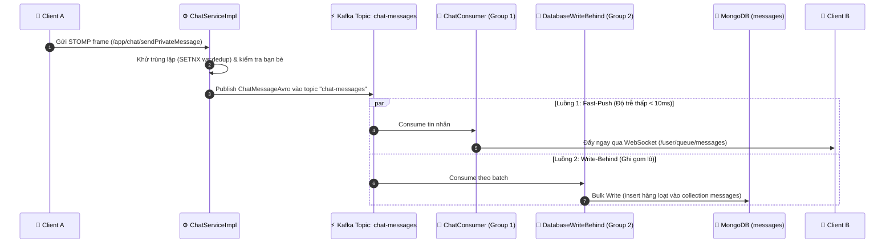

# Quyết Định Kiến Trúc (Architecture Decision Records - ADR)

Tài liệu này ghi lại các quyết định thiết kế quan trọng nhất trong hệ thống ChatWeb, lý do lựa chọn (rationale), các giải pháp thay thế đã được cân nhắc, và sự đánh đổi (trade-offs).

---

## ADR-01: Sử Dụng Mô Hình Lưu Trữ Đa Dạng (Polyglot Persistence)

### Ngữ cảnh
Một ứng dụng nhắn tin thời gian thực vừa có các dữ liệu quan hệ chặt chẽ (tài khoản, bạn bè, phân quyền), vừa có dữ liệu tin nhắn phi cấu trúc với tần suất ghi lớn, vừa đòi hỏi các cấu trúc dữ liệu in-memory tốc độ cao cho phiên kết nối và trạng thái trực tuyến. Nếu chỉ dùng 1 loại cơ sở dữ liệu duy nhất, hệ thống sẽ gặp các nút thắt cổ chai về I/O hoặc vi phạm tính toàn vẹn dữ liệu.

### Quyết định
Chia tách cơ sở dữ liệu thành 3 tầng chuyên biệt:
1. **PostgreSQL**:
   - Lưu trữ: `users`, `roles`, `permissions`, `friendships`, `addresses`.
   - Lý do: Yêu cầu tính toàn vẹn quan hệ (Foreign Keys, Constraints), bảo đảm tính nhất quán nghiêm ngặt (ACID) cho luồng đăng ký, phân quyền và quản lý bạn bè.
2. **MongoDB**:
   - Lưu trữ: `messages` ([ChatMessage.java](file:///home/phanhuukha/Dev/ChatWeb/chatweb_be/src/main/java/com/web/backend/model/mongodb/ChatMessage.java)), `read_receipts`, `system_message`.
   - Lý do: Dữ liệu tin nhắn tăng trưởng theo thời gian, kích thước linh hoạt (văn bản, emoji, fileUrl, reactions map). MongoDB hỗ trợ ghi hàng loạt (bulk write) cực nhanh và có tính năng TTL Index tự động hủy tin nhắn hệ thống.
3. **Redis Stack**:
   - Lưu trữ: Trạng thái presence, bộ đếm session, caching tin nhắn gần nhất, blacklist token, hàng đợi Sliding Window Rate Limit, khóa lũy đẳng `@Idempotent`, và bộ lọc Cuckoo Filter (`filter:usernames`, `filter:emails`).
   - Lý do: Tốc độ phản hồi microsecond, cung cấp sẵn các cấu trúc dữ liệu mạnh mẽ (Sorted Set, Hash, Cuckoo Filter).

### Đánh đổi (Trade-offs)
- **Ưu điểm**: Tối ưu hiệu năng tối đa cho từng nghiệp vụ; không bị nghẽn I/O giữa tác vụ đọc tài khoản và tác vụ ghi hàng triệu tin nhắn chat.
- **Nhược điểm**: Phải quản lý nhiều engine cơ sở dữ liệu; tính nhất quán giữa Postgres và Mongo được bảo đảm theo mô hình Eventual Consistency qua Kafka.

---

## ADR-02: Phân Tách Luồng Đẩy Tin Nhắn và Ghi Database Qua Kafka (Dual Consumer Groups)

### Ngữ cảnh
Khi người dùng A gửi tin nhắn cho người dùng B:
- Nếu Backend thực hiện ghi vào database trước rồi mới gửi WebSocket: Độ trễ giao tiếp sẽ phụ thuộc vào tốc độ ghi đĩa của database. Khi có tải lớn, DB nghẽn I/O sẽ khiến tin nhắn hiển thị rất chậm.
- Nếu Backend chỉ gửi WebSocket mà không có cơ chế đệm tin: Khi DB tạm thời quá tải hoặc restart, tin nhắn sẽ bị mất vĩnh viễn.

### Quyết định
Áp dụng mô hình **Write-Behind** kết hợp **Competing Consumer Groups** trên cùng một topic Kafka (`chat-messages`):

### Đánh đổi (Trade-offs)
- **Ưu điểm**: Người nhận thấy tin nhắn gần như tức thì mà không phải chờ database hoàn tất lệnh INSERT; CSDL MongoDB được bảo vệ khỏi tình trạng quá tải nhờ khả năng đệm (buffering) của Kafka.
- **Nhược điểm**: Trường hợp hãn hữu khi DB gặp sự cố nghiêm trọng, tin nhắn đã hiển thị trên màn hình nhưng chưa kịp ghi vào đĩa (xử lý triệt để bằng hàng đợi thư chết `chat-messages-save-dlt` để cứu hộ).

---

## ADR-03: Cơ Chế Định Tuyến WebSocket Đa Node Bằng Redis Hash & Pub/Sub

### Ngữ cảnh
Khi hệ thống mở rộng ngang (Horizontal Scaling) thành nhiều instance backend phía sau Nginx Load Balancer, kết nối WebSocket là Stateful (duy trì liên tục). Người gửi A có thể kết nối vào `Server-1`, trong khi người nhận B lại đang kết nối vào `Server-2`. Server 1 không thể trực tiếp gửi frame tới Server 2 nếu không có cơ chế định tuyến liên node.

### Quyết định
Sử dụng kiến trúc phân tán điều phối bởi **Redis Hash** và **Redis Pub/Sub**:
1. **Lập bản đồ phiên kết nối**: Khi một user kết nối WebSocket, backend tự gán một định danh `ServerIdentity.SERVER_ID` và lưu vào Redis Hash `ws:routing:servers:{username}`.
2. **Định tuyến thông minh (`WebSocketRoutingService`)**:
   - Nếu người nhận có session ngay trên server hiện tại: Đẩy trực tiếp ra WebSocket Session cục bộ.
   - Nếu người nhận đang ở server khác: Publish bản tin bọc (`RedisWsMessage`) vào kênh `channel:server:{targetServerId}`. Node server đích lắng nghe kênh này sẽ nhận gói tin và bắn xuống client của họ.

---

## ADR-04: Chiến Lược Giới Hạn Tốc Độ Hai Tầng (Two-Tier Rate Limiting)

### Ngữ cảnh
Hệ thống chat đối mặt với các nguy cơ spam tin nhắn, brute-force mật khẩu và tấn công từ chối dịch vụ (DoS/DDoS). Cần có cơ chế rate limiting hiệu quả ở cả tầng mạng và tầng ứng dụng.

### Quyết định
Thiết lập giới hạn tốc độ 2 tầng:
1. **Tầng Ingress (Nginx - IP Level)**:
   - Sử dụng module `ngx_http_limit_req_module` chặn đứng các luồng tấn công tầng mạng trước khi chạm tới Spring Boot:
     - Auth Zone: Tối đa 10 requests/phút (burst 5).
     - Global Zone: Tối đa 30 requests/giây (burst 20).
2. **Tầng Ứng Dụng (Spring Boot - User & Method Level)**:
   - Cài đặt `@RateLimit` kết hợp **thuật toán Sliding Window Log** chạy bằng Lua Script trên Redis Stack:
     - Tự động dọn dẹp các yêu cầu ngoài cửa sổ trượt bằng `ZREMRANGEBYSCORE`.
     - Đếm số lượng trong cửa sổ trượt bằng `ZCARD`. Nếu nhỏ hơn `limit` thì thêm yêu cầu mới vào Sorted Set bằng `ZADD` với score = timestamp hiện tại.
     - Cho phép cấu hình theo `LimitType.USER` (dựa trên username xác thực) hoặc `LimitType.IP`.

---

## ADR-05: Cơ Chế Bảo Đảm Tính Lũy Đẳng (Idempotency) & Chống Gửi Trùng Lặp (Deduplication)

### Ngữ cảnh
Trong điều kiện mạng di động hoặc Wi-Fi chập chờn, Client thường tự động retry khi không nhận được ACK phản hồi kịp thời. Điều này có thể dẫn tới việc gửi lặp 2 lần cùng một tin nhắn, tạo 2 lời mời kết bạn, hoặc upload lặp tệp tin gây lãng phí dung lượng.

### Quyết định
Triển khai giải pháp chống trùng lặp đa tầng:
1. **Tầng REST API (`@Idempotent`)**:
   - Áp dụng trên các endpoint quan trọng (upload ảnh/video, chấp nhận kết bạn). Client gửi header `X-Idempotency-Key: <UUID>`.
   - [`IdempotentAspect.java`](file:///home/phanhuukha/Dev/ChatWeb/chatweb_be/src/main/java/com/web/backend/idempotent/IdempotentAspect.java) sử dụng Redis khóa `idempotent:{key}:{idempotencyKey}`. Nếu request có cùng key gửi lại trong khoảng TTL (300-600s), hệ thống lập tức từ chối hoặc trả về kết quả đã xử lý.
2. **Tầng WebSocket STOMP (`ws:dedup`)**:
   - Client sinh `localId` (UUID) cho mỗi tin nhắn trước khi gửi qua WebSocket.
   - Backend dùng lệnh `SETNX` với key `ws:dedup:{sender}:{localId}` (TTL 300 giây). Nếu key đã tồn tại (gói tin retry), server âm thầm bỏ qua để tránh phát tán trùng lặp.
3. **Tầng Lưu Trữ MongoDB**:
   - Bắt ngoại lệ `DuplicateKeyException` trong `DatabaseWriteBehindConsumer` để đảm bảo thao tác ghi gom lô (bulk insert) luôn mang tính lũy đẳng.

---

## ADR-06: Cơ Chế Debounce 5 Giây Xử Lý Hiện Diện (Online/Offline Presence)

### Ngữ cảnh
Khi người dùng tải lại trang (F5) hoặc mạng di động chuyển giao giữa 4G và Wi-Fi, kết nối WebSocket sẽ bị ngắt (DISCONNECT) và mở lại ngay lập tức (CONNECT) sau 1 - 2 giây. Nếu hệ thống lập tức cập nhật CSDL và phát sóng thông báo "Người dùng đã Offline" rồi ngay sau đó lại phát "Người dùng đã Online", mạng lưới bạn bè sẽ nhận thông báo rác liên tục (Flapping Presence).

### Quyết định
Thiết lập bộ đếm session kết hợp trễ hoãn 5 giây (Debounce 5s) tại [WebSocketListener.java](file:///home/phanhuukha/Dev/ChatWeb/chatweb_be/src/main/java/com/web/backend/listener/WebSocketListener.java):
1. Quản lý tổng số tab/session đang mở của mỗi user trong Redis Hash `online_users_count`.
2. Khi một kết nối đóng, trừ 1 khỏi bộ đếm.
3. Chỉ khi bộ đếm rơi về $\le 0$, hệ thống **không vội cập nhật Offline ngay** mà lên lịch trì hoãn 5 giây qua `ScheduledExecutorService`.
4. Sau 5 giây, kiểm tra lại bộ đếm một lần nữa:
   - Nếu người dùng đã kết nối lại (count > 0): Hủy bỏ sự kiện Offline (giữ nguyên trạng thái Online mượt mà).
   - Nếu người dùng thực sự vẫn ngắt kết nối (count <= 0): Chính thức cập nhật trạng thái `isOnline = false` trong PostgreSQL, xóa khỏi Redis ZSet `online_users` và phát sóng sự kiện Offline tới danh sách bạn bè.
