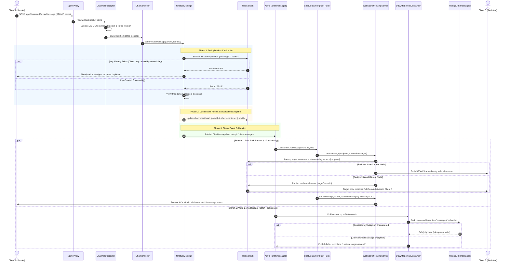
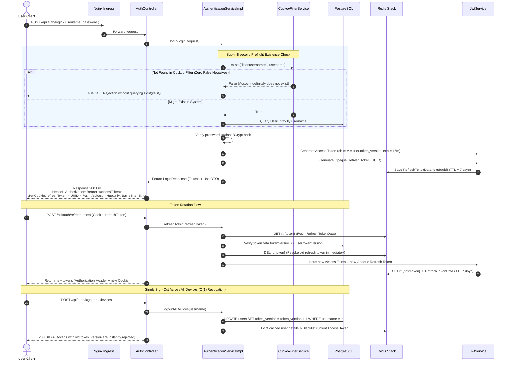
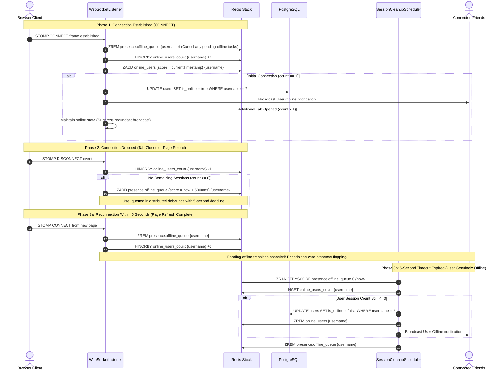
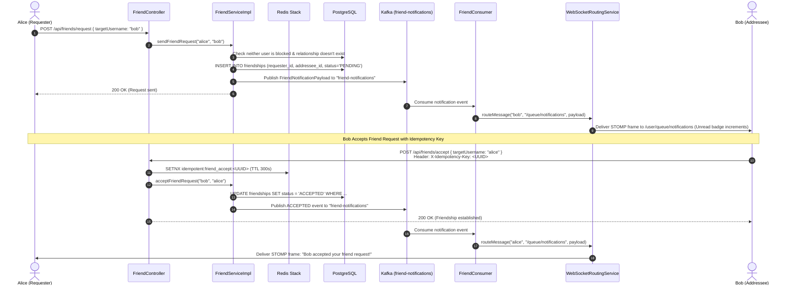
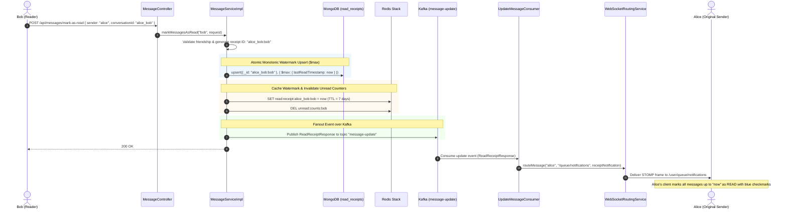

# Core Business Sequence Diagrams

This document details the end-to-end communication flows across the Client, Nginx Ingress, Spring Boot Backend, Redis Stack, Apache Kafka, PostgreSQL, and MongoDB for the five most critical business operations in ChatWeb.

---

## 1. Real-Time Chat Pipeline

Traces the complete lifecycle of a private message from transmission by Client A to instant screen rendering for Client B and asynchronous bulk persistence into MongoDB.

---

## 2. Authentication, Token Rotation, and Single Sign-Out

Illustrates user login, access token issuance in headers, refresh token storage in HttpOnly cookies, token rotation, and instant global revocation via `token_version`.

---

## 3. Distributed Presence Lifecycle & 5-Second Debounce Queue

Demonstrates connection tracking and the elimination of presence flapping when users refresh pages or experience transient disconnections.

---

## 4. Friend Request & Real-Time Notification Pipeline

Illustrates sending and accepting friend requests with idempotency protection and push notification routing.

---

## 5. Watermark-Based Read Receipt Lifecycle

Illustrates atomic read receipt tracking, Redis TTL caching, and real-time read receipt updates sent back to the message author.

