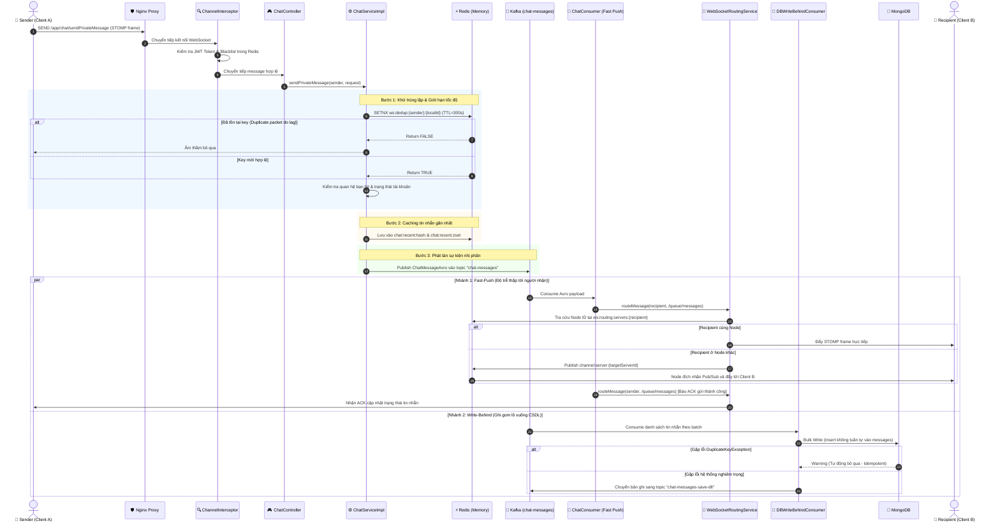
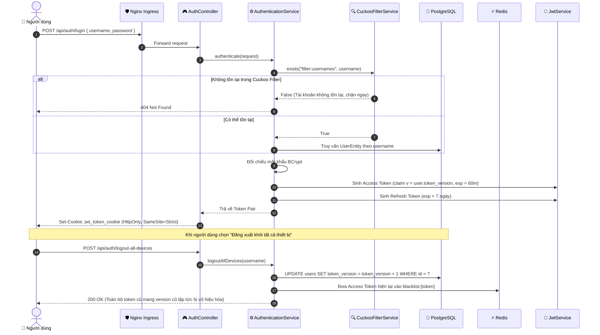
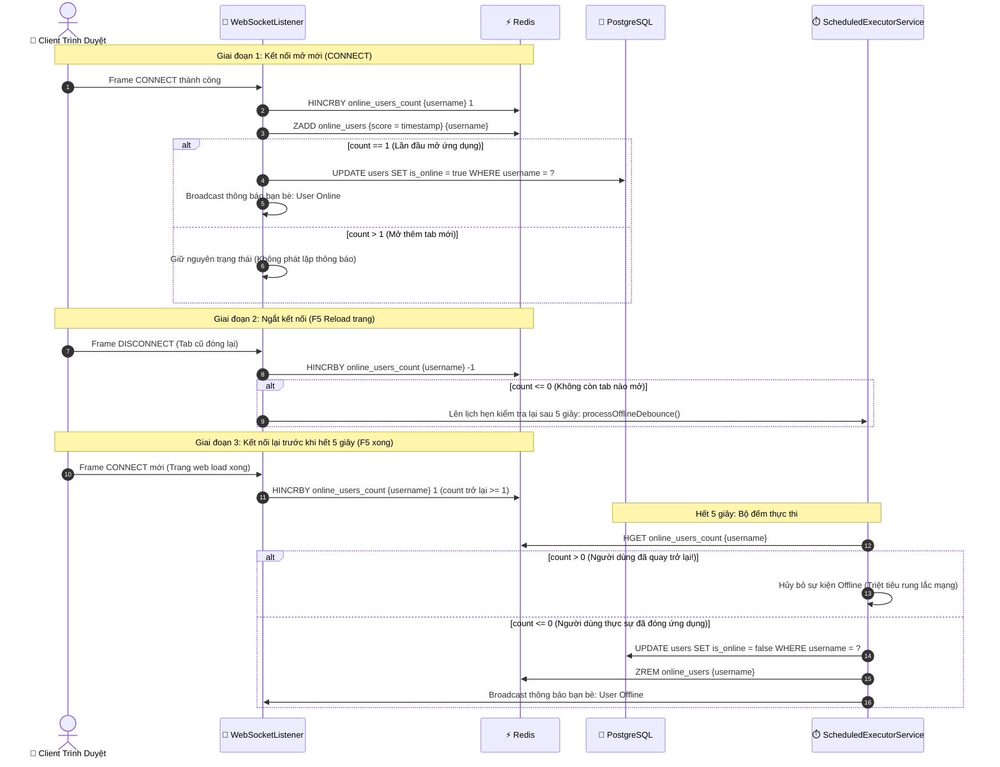
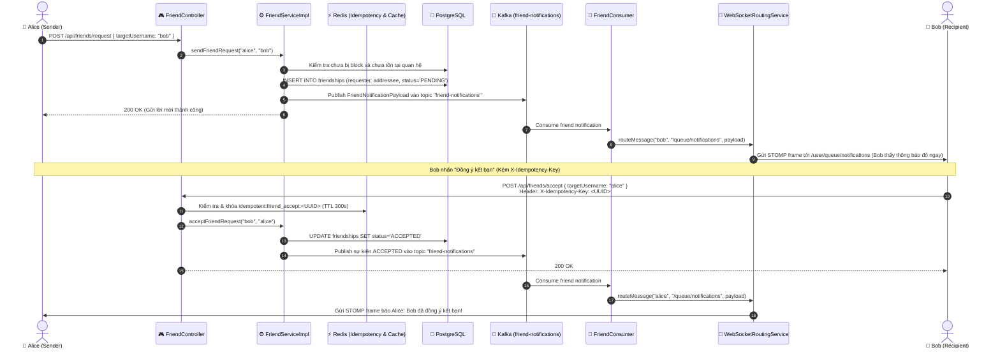

# Sơ Đồ Tuần Tự Nghiệp Vụ Cốt Lõi (Sequence Diagrams)

Tài liệu này cung cấp các sơ đồ tuần tự chi tiết mô tả sự tương tác giữa Client, Nginx, Spring Boot Backend, Redis, Kafka và Database cho 4 luồng nghiệp vụ quan trọng nhất của hệ thống ChatWeb.

---

## 1. Luồng Gửi và Nhận Tin Nhắn Thời Gian Thực (Real-time Chat Pipeline)

Sơ đồ thể hiện toàn bộ hành trình của một tin nhắn từ khi người gửi nhấn "Gửi" cho đến khi người nhận hiển thị tin nhắn trên màn hình và tin nhắn được lưu vĩnh viễn vào MongoDB.

---

## 2. Luồng Xác Thực, Cấp Phát Token & Single Sign-Out (`token_version`)

Sơ đồ mô tả quy trình đăng nhập, cấp phát Cookie bảo mật và cơ chế thu hồi phiên tức thì trên toàn bộ thiết bị.

---

## 3. Luồng Quản Lý Trạng Thái Hiện Diện (Presence Lifecycle & Debouncing)

Cơ chế chống nhiễu Flapping khi người dùng reload trình duyệt hoặc mạng chuyển tiếp nhanh.

---

## 4. Luồng Lời Mời Kết Bạn & Thông Báo Thời Gian Thực (Friend Request & Notification Pipeline)

Sơ đồ mô tả quy trình gửi và chấp nhận lời mời kết bạn với cơ chế bảo đảm tính lũy đẳng (Idempotency) và thông báo đẩy thời gian thực qua Kafka và WebSocket.

