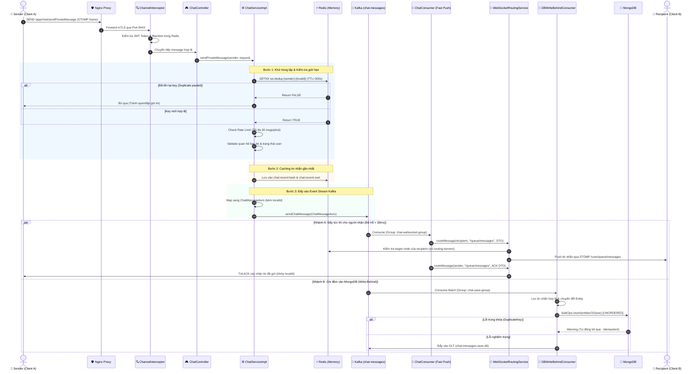
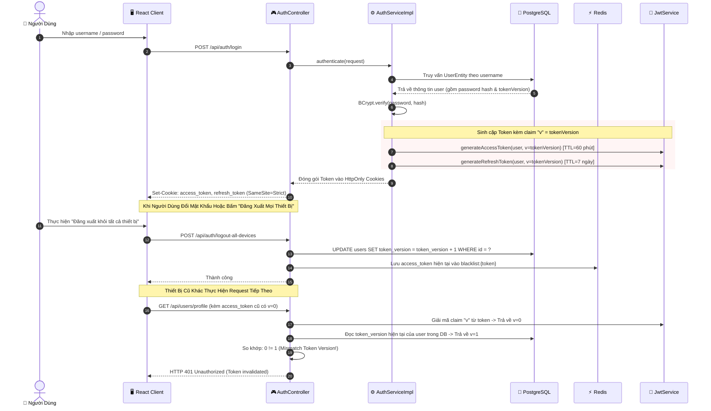
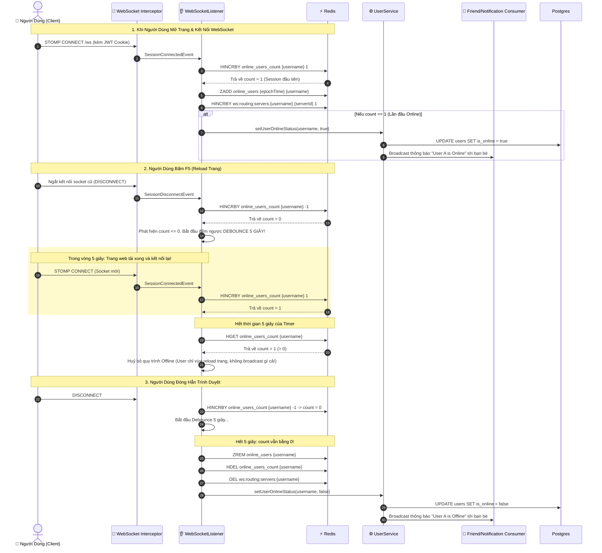
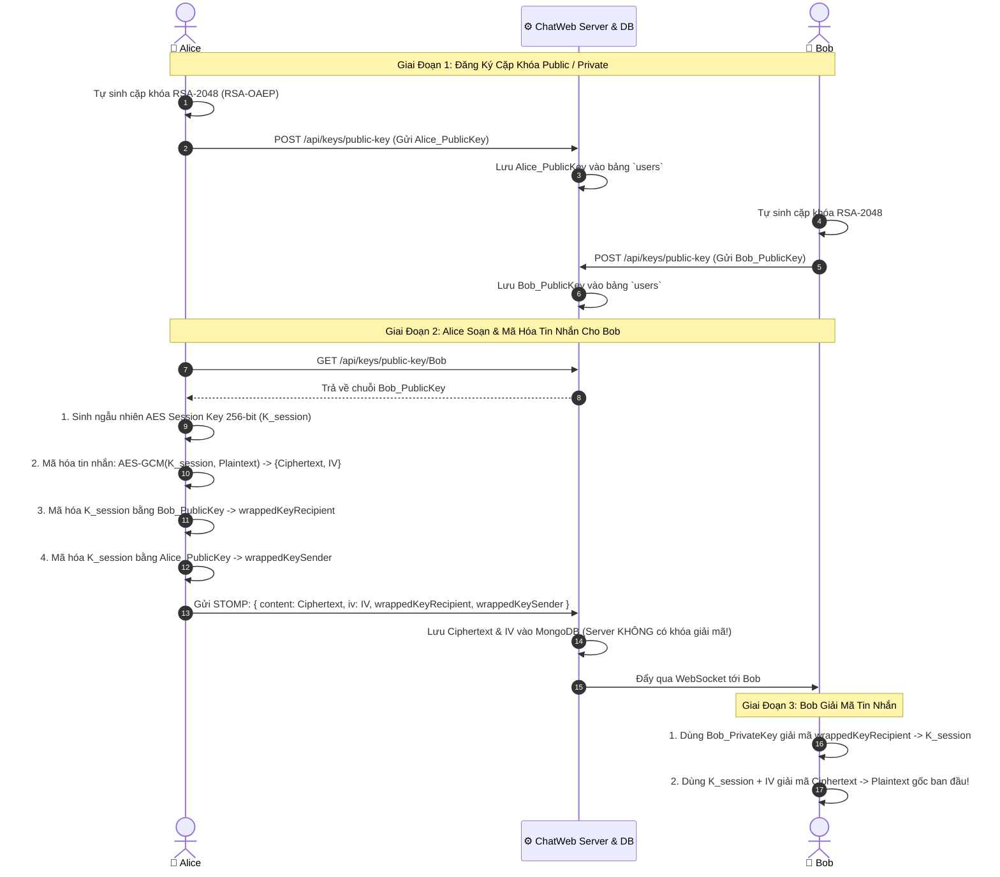

# Sơ Đồ Tuần Tự Nghiệp Vụ Cốt Lõi (Sequence Diagrams)

Tài liệu này cung cấp các sơ đồ tuần tự chi tiết mô tả sự tương tác giữa Client, Nginx, Spring Boot Backend, Redis, Kafka và Database cho 4 luồng nghiệp vụ quan trọng nhất của hệ thống ChatWeb.

---

## 1. Luồng Gửi và Nhận Tin Nhắn Thời Gian Thực (Real-time Chat Pipeline)

Sơ đồ thể hiện toàn bộ hành trình của một tin nhắn từ khi người gửi nhấn "Gửi" cho đến khi người nhận hiển thị tin nhắn trên màn hình và tin nhắn được lưu vĩnh viễn vào MongoDB.

---

## 2. Luồng Xác Thực, Cấp Phát Token & Thu Hồi Phiên (Token Versioning)

Sơ đồ mô tả quy trình đăng nhập, cơ chế lưu trữ JWT an toàn bằng HttpOnly Cookie, và tính năng **Single Sign-Out** tức thì thông qua trường `token_version`.

---

## 3. Luồng Quản Lý Hiện Diện & Cơ Chế Debounce 5 Giây (Presence Lifecycle)

Xử lý trạng thái người dùng (Online/Offline), đảm bảo khi người dùng tải lại trang (F5) không bị phát tín hiệu Offline giả tới bạn bè.

---

## 4. Luồng Trao Đổi Khóa & Mã Hóa Đầu-Cuối (E2EE Key Exchange)

Quy trình bảo mật đảm bảo Server không thể đọc được nội dung tin nhắn của người dùng.

