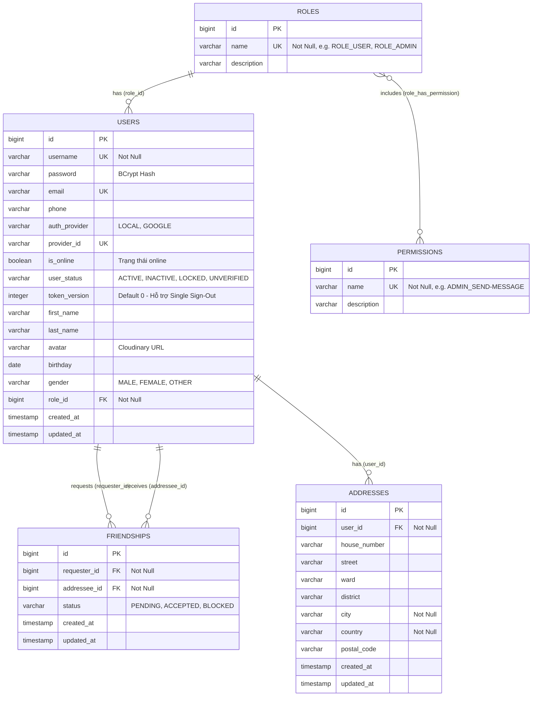

# Thiết Kế Cơ Sở Dữ Liệu Đa Dạng (Polyglot Database Design)

Tài liệu này mô tả chi tiết thiết kế lưu trữ dữ liệu của hệ thống ChatWeb trên cả 3 tầng: **PostgreSQL (Quan hệ)**, **MongoDB (NoSQL Document)** và **Redis (In-Memory Data Structures & Filter)**.

---

## 1. Tầng Quan Hệ: PostgreSQL (RDBMS)

PostgreSQL chịu trách nhiệm bảo toàn tính toàn vẹn nghiệp vụ, xác thực tài khoản, quyền hạn RBAC và quan hệ bạn bè.

### 1.1. Sơ Đồ Thực Thể Quan Hệ (Entity-Relationship Diagram)

### 1.2. Chiến Lược Đánh Chỉ Mục (Index Optimization)
- **Bảng `users`**:
  - Index `idx_user_status` trên cột `user_status`: Tối ưu các câu lệnh lọc tài khoản hoạt động/bị khóa.
  - Index `idx_user_role_id` trên cột `role_id`: Tối ưu nạp quyền hạn khi xác thực JWT.
  - Khóa duy nhất (Unique Index): `username`, `email`, `provider_id`.
- **Bảng `friendships`**:
  - Unique Constraint `(requester_id, addressee_id)`: Ngăn trùng lặp lời mời kết bạn giữa 2 người.
  - Index `idx_friendship_requester_status` trên `(requester_id, status)`.
  - Index `idx_friendship_addressee_status` trên `(addressee_id, status)`.
- **Bảng `addresses`**:
  - Index `idx_address_user_id` trên cột `user_id`: Tối ưu truy vấn danh sách địa chỉ theo từng người dùng.
- **Bảng `roles`**:
  - Index `idx_role_name` trên cột `name`.

---

## 2. Tầng Tài Liệu: MongoDB (NoSQL)

MongoDB lưu trữ các thực thể phi cấu trúc, có tần suất ghi và đọc theo phân trang lớn.

### 2.1. Collection `messages` (Tin Nhắn Chat)
Lưu trữ toàn bộ tin nhắn 1-1, tin nhắn đính kèm tệp và tương tác reactions.

| Tên trường (Field) | Kiểu dữ liệu | Ý nghĩa & Quy ước |
| :--- | :--- | :--- |
| `_id` | `ObjectId / String` | Định danh duy nhất của tin nhắn. |
| `conversationId` | `String` | Định danh hội thoại 1-1 theo chuẩn: `{minUsername}_{maxUsername}`. |
| `sender` | `String` (Indexed) | Username người gửi. |
| `recipient` | `String` | Username người nhận. |
| `content` | `String` | Nội dung tin nhắn văn bản. |
| `contentType` | `String` (Enum) | `TEXT`, `IMAGE`, `VIDEO`, `FILE`. |
| `messageType` | `String` (Enum) | `CHAT`, `TYPING`. |
| `color` | `String` | Mã màu hiển thị bong bóng chat. |
| `replyToId` | `String` | `_id` của tin nhắn được phản hồi (Quote reply). |
| `fileUrl` | `String` | Đường dẫn tệp tải lên (Cloudinary). |
| `fileName` | `String` | Tên gốc của tệp. |
| `fileSize` | `Long` | Dung lượng tệp tính bằng bytes. |
| `timestamp` | `Instant (ISODate)` | Thời điểm gửi tin nhắn. |
| `status` | `String` (Enum) | `SENDING`, `SENT`, `READ`. |
| `isEdited` | `Boolean` | Đánh dấu tin nhắn đã qua chỉnh sửa. |
| `isDeleted` | `Boolean` | Đánh dấu thu hồi tin nhắn (Xóa mềm). |
| `isReacted` | `Boolean` | Đã có reaction emoji hay chưa. |
| `reactions` | `Map<String, String>` | Danh sách tương tác: `{ "username": "❤️", ... }`. |

#### Chỉ Mục Tổ Hợp (Compound Indexes):
1. **`conv_msg_time_idx`**: `{"conversationId": 1, "messageType": 1, "timestamp": -1}`  
   *Mục đích*: Tối ưu truy vấn lịch sử tin nhắn dạng con trỏ (Cursor-based pagination).
2. **`unread_msg_idx`**: `{"recipient": 1, "status": 1, "messageType": 1, "sender": 1}`  
   *Mục đích*: Thống kê và lấy nhanh số lượng tin nhắn chưa đọc theo từng bạn bè.
3. **`conv_content_time_idx`**: `{"conversationId": 1, "messageType": 1, "isDeleted": 1, "timestamp": -1}`  
   *Mục đích*: Tối ưu tìm kiếm nội dung trong cuộc trò chuyện và lọc các tin nhắn chưa bị xóa mềm.
4. **`conv_recipient_status_idx`**: `{"conversationId": 1, "recipient": 1, "status": 1, "messageType": 1}`  
   *Mục đích*: Đánh dấu hàng loạt trạng thái đã đọc (`SENT` -> `READ`) khi mở cuộc hội thoại.

---

### 2.2. Collection `read_receipts` (Biên Nhận Đã Đọc)
Theo dõi mốc đọc tin nhắn cuối cùng của từng thành viên trong cuộc trò chuyện.

| Tên trường | Kiểu dữ liệu | Ý nghĩa |
| :--- | :--- | :--- |
| `_id` | `String` | ID biên nhận. |
| `conversationId` | `String` (Indexed) | ID cuộc trò chuyện. |
| `username` | `String` (Indexed) | Người đọc. |
| `lastReadTimestamp` | `Instant` | Thời điểm đọc tin nhắn gần nhất. |
| `lastReadMessageId` | `String` | ID của tin nhắn đã đọc sau cùng. |

#### Chỉ Mục Duy Nhất:
- **`conv_user_idx`**: `{"conversationId": 1, "username": 1}`, `unique = true`  
  Đảm bảo mỗi user chỉ có duy nhất 1 bản ghi vị trí đọc trong mỗi cuộc trò chuyện (Upsert Operation).

---

### 2.3. Collection `system_message` (Tin Nhắn Thông Báo Hệ Thống)
Thông báo phát thanh từ Ban Quản Trị (Admin) gửi tới toàn thể người dùng.

| Tên trường | Kiểu dữ liệu | Ý nghĩa |
| :--- | :--- | :--- |
| `_id` | `String` | ID thông báo. |
| `sender` | `String` | Tên tài khoản Admin phát thông báo. |
| `content` | `String` | Nội dung thông báo hệ thống. |
| `timestamp` | `Instant` | Thời gian phát sóng. |
| `expiresAt` | `Instant` (Indexed) | Thời điểm hết hạn thông báo. |

#### Chỉ Mục Tự Hủy (TTL Index):
- **`expiresAt_ttl_idx`**: `@Indexed(expireAfter = "0s")` trên trường `expiresAt`.  
  Tiến trình nền của MongoDB tự động xóa bản ghi khi thời gian hiện tại vượt quá `expiresAt`.

---

## 3. Tầng Bộ Nhớ Đệm, Lọc & Trạng Thái: Redis (Redis Stack)

Redis Stack đóng vai trò là bộ nhớ trung tâm kết nối các node backend, định tuyến WebSocket và kiểm tra nhanh.

| Quy ước Key (Pattern) | Cấu trúc dữ liệu | Thời gian sống (TTL) | Mục đích sử dụng |
| :--- | :--- | :--- | :--- |
| `online_users` | **Sorted Set (ZSet)** | Không hết hạn | Danh sách user đang online. `Score` = Epoch Timestamp ping gần nhất. |
| `online_users_count` | **Hash** | Không hết hạn | Key là `username`, value là tổng số session WebSocket đang mở. |
| `ws:routing:servers:{username}` | **Hash** | Không hết hạn | Key là `serverId`, value là số session trên node server đó. |
| `channel:server:{serverId}` | **Redis Pub/Sub** | N/A (Streaming) | Kênh trao đổi tin nhắn định tuyến liên node backend. |
| `ws:dedup:{sender}:{localId}` | **String** | **300 giây (5 phút)** | Lệnh `SETNX` chống nhận tin nhắn trùng lặp khi client tự retry do lag mạng. |
| `chat:recent:hash:{convId}` | **Hash** | 24 giờ | Cache nội dung tin nhắn mới nhất để hiển thị nhanh danh sách chat list. |
| `chat:recent:zset:{convId}` | **Sorted Set (ZSet)** | 24 giờ | Lưu danh sách message ID gần nhất với score = timestamp. |
| `blacklist:{token}` | **String** | Bằng TTL của JWT | Danh sách Access Token bị thu hồi (đăng xuất sớm). |
| `register:{email}` | **Object (Java Serialized)** | 5 phút | Dữ liệu đăng ký tạm thời (`RegisterData`) kèm mã OTP xác thực email. |
| `filter:usernames` | **Cuckoo Filter (CF)** | Bền vững | Kiểm tra nhanh username đã tồn tại hay chưa bằng lệnh Redis `CF.EXISTS` trước khi query PostgreSQL. |
| `filter:emails` | **Cuckoo Filter (CF)** | Bền vững | Kiểm tra nhanh email đã đăng ký hay chưa bằng lệnh Redis `CF.EXISTS`. |
| `rate_limit:{targetKey}` | **Sorted Set (ZSet)** | Window + 2s | Triển khai thuật toán Sliding Window Log bằng Lua script để giới hạn tốc độ request. |
| `idempotent:{key}:{idempotencyKey}` | **String** | 300 - 600 giây | Khóa lũy đẳng `@Idempotent` (Header `X-Idempotency-Key`) chống gọi lặp các tác vụ upload/kết bạn. |
