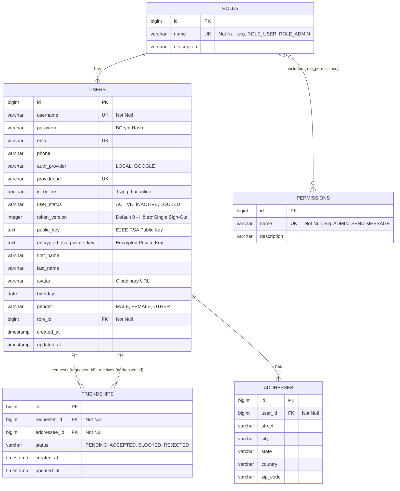

# Thiết Kế Cơ Sở Dữ Liệu Đa Dạng (Polyglot Database Design)

Tài liệu này mô tả chi tiết thiết kế lưu trữ dữ liệu của hệ thống ChatWeb trên cả 3 tầng: **PostgreSQL (Quan hệ)**, **MongoDB (NoSQL Document)** và **Redis (In-Memory Data Structures)**.

---

## 1. Tầng Quan Hệ: PostgreSQL (RDBMS)

PostgreSQL chịu trách nhiệm bảo toàn tính toàn vẹn nghiệp vụ, xác thực tài khoản, quyền hạn RBAC và quan hệ bạn bè.

### 1.1. Sơ Đồ Thực Thể Quan Hệ (Entity-Relationship Diagram)

### 1.2. Chiến Lược Đánh Chỉ Mục (Index Optimization)
- **Bảng `users`**:
  - Index `idx_user_status` trên cột `user_status`: Tối ưu các câu lệnh kiểm tra tài khoản còn hoạt động hay bị khóa/xóa.
  - Index `idx_user_role_id` trên cột `role_id`: Tối ưu eager/lazy loading quyền hạn khi xác thực JWT.
  - Khóa duy nhất (Unique Index) trên các cột: `username`, `email`, `provider_id`.
- **Bảng `friendships`**:
  - Unique Constraint `(requester_id, addressee_id)`: Ngăn chặn tuyệt đối việc gửi trùng lặp lời mời kết bạn giữa 2 người.
  - Index `idx_friendship_requester_status` trên `(requester_id, status)`.
  - Index `idx_friendship_addressee_status` trên `(addressee_id, status)`.
  - Hai chỉ mục tổ hợp trên giúp các thao tác kiểm tra tình trạng bạn bè (`isFriend`) và lấy danh sách bạn bè đang hoạt động có tốc độ truy vấn $O(\log N)$ cực nhanh.

---

## 2. Tầng Tài Liệu: MongoDB (NoSQL)

MongoDB lưu trữ toàn bộ các thực thể phi cấu trúc, có tần suất ghi và đọc theo phân trang lớn.

### 2.1. Collection `messages` (Tin Nhắn Chat)
Lưu trữ toàn bộ tin nhắn 1-1, tin nhắn kèm file, và các metadata mã hóa đầu-cuối.

| Tên trường (Field) | Kiểu dữ liệu | Ý nghĩa & Quy ước |
| :--- | :--- | :--- |
| `_id` | `ObjectId / String` | Định danh duy nhất của tin nhắn. |
| `conversationId` | `String` | Định danh hội thoại 1-1 theo chuẩn: `{minUsername}_{maxUsername}`. |
| `sender` | `String` (Indexed) | Username người gửi. |
| `recipient` | `String` | Username người nhận. |
| `content` | `String` | Nội dung tin nhắn (Plaintext hoặc Ciphertext nếu bật E2EE). |
| `contentType` | `String` (Enum) | `TEXT`, `IMAGE`, `VIDEO`, `FILE`, `AUDIO`. |
| `messageType` | `String` (Enum) | `CHAT`, `TYPING`, `CALL`. |
| `color` | `String` | Mã màu sắc tùy biến của bubble chat. |
| `replyToId` | `String` | `_id` của tin nhắn được trả lời (Quote reply). |
| `fileUrl` | `String` | Đường dẫn file trên Cloudinary. |
| `fileName` | `String` | Tên gốc của file tải lên. |
| `fileSize` | `Long` | Dung lượng file tính bằng bytes. |
| `timestamp` | `Instant (ISODate)` | Thời điểm gửi tin nhắn. |
| `status` | `String` (Enum) | `SENDING`, `SENT`, `DELIVERED`, `READ`, `FAILED`. |
| `isEdited` | `Boolean` | Cờ đánh dấu tin nhắn đã từng bị chỉnh sửa. |
| `isDeleted` | `Boolean` | Cờ xóa mềm (Soft-delete: "Tin nhắn đã bị thu hồi"). |
| `isReacted` | `Boolean` | Đã có reaction emoji hay chưa. |
| `reactions` | `Map<String, String>` | Bản đồ tương tác: `{ "username": "❤️", ... }`. |
| `iv` | `String` | Initialization Vector ngẫu nhiên phục vụ giải mã AES-GCM (E2EE). |
| `wrappedKeyRecipient`| `String` | Khóa AES đã được mã hóa bằng Public Key của người nhận (E2EE). |
| `wrappedKeySender` | `String` | Khóa AES đã được mã hóa bằng Public Key của người gửi (E2EE). |

#### Chỉ Mục Tổ Hợp (Compound Indexes):
1. **`conv_msg_time_idx`**: `{"conversationId": 1, "messageType": 1, "timestamp": -1}`
   - *Mục đích*: Tối ưu hóa tuyệt đối cho API cuộn trang lấy lịch sử chat (Cursor-based Pagination). Truy vấn lấy 20 tin nhắn gần nhất chỉ tốn vài mili-giây mà không cần quét toàn bảng (Index Scan).
2. **`unread_msg_idx`**: `{"recipient": 1, "status": 1, "messageType": 1}`
   - *Mục đích*: Đếm và lấy nhanh danh sách tin nhắn chưa đọc của một người dùng khi họ vừa đăng nhập vào hệ thống.

---

### 2.2. Collection `read_receipts` (Biên Nhận Đã Đọc)
Theo dõi vị trí đọc tin nhắn cuối cùng của từng thành viên trong một cuộc trò chuyện.

| Tên trường | Kiểu dữ liệu | Ý nghĩa |
| :--- | :--- | :--- |
| `_id` | `String` | ID biên nhận. |
| `conversationId` | `String` (Indexed) | ID cuộc trò chuyện. |
| `username` | `String` (Indexed) | Người đọc. |
| `lastReadTimestamp` | `Instant` | Thời điểm đọc tin nhắn gần nhất. |
| `lastReadMessageId` | `String` | ID của tin nhắn đọc sau cùng. |

#### Chỉ Mục Duy Nhất:
- **`conv_user_idx`**: `{"conversationId": 1, "username": 1}`, `unique = true`
  - Đảm bảo mỗi user chỉ có duy nhất 1 bản ghi vị trí đọc trong mỗi cuộc trò chuyện (Upsert Operation).

---

### 2.3. Collection `system_message` (Tin Nhắn Thông Báo Hệ Thống)
Thông báo chung từ Ban Quản Trị (Admin) gửi tới toàn thể người dùng.

| Tên trường | Kiểu dữ liệu | Ý nghĩa |
| :--- | :--- | :--- |
| `_id` | `String` | ID thông báo. |
| `sender` | `String` | Tên Admin phát thông báo. |
| `content` | `String` | Nội dung thông báo hệ thống. |
| `timestamp` | `Instant` | Thời gian phát sóng. |
| `expiresAt` | `Instant` (Indexed) | Thời điểm hết hạn thông báo. |

#### Chỉ Mục Tự Hủy (TTL Index):
- **`expiresAt_ttl_idx`**: `@Indexed(expireAfter = "0s")` trên trường `expiresAt`.
  - MongoDB có một tiến trình chạy ngầm (background thread) định kỳ quét các document có `expiresAt <= CurrentTime` và tự động xóa vĩnh viễn khỏi database mà backend không cần phải viết job dọn rác thủ công.

---

## 3. Tầng Bộ Nhớ Đệm & Trạng Thái: Redis

Redis đóng vai trò là bộ nhớ trung tâm kết nối các node backend và duy trì trạng thái thời gian thực.

| Quy ước Key (Pattern) | Cấu trúc dữ liệu | Thời gian sống (TTL) | Mục đích sử dụng |
| :--- | :--- | :--- | :--- |
| `online_users` | **Sorted Set (ZSet)** | Không hết hạn | Lưu danh sách user đang online. `Score` = Epoch Timestamp lần ping gần nhất. Hỗ trợ quét và xóa user bị rớt mạng bất thường. |
| `online_users_count` | **Hash** | Không hết hạn | Key là `username`, value là số lượng session WebSocket đang mở (1 user mở 3 tab trình duyệt thì count = 3). |
| `ws:routing:servers:{username}` | **Hash** | Không hết hạn | Key là `serverId` (Node ID), value là số session trên node đó. Dùng cho việc định tuyến WebSocket liên node. |
| `channel:server:{serverId}` | **Redis Pub/Sub** | N/A (Streaming) | Kênh thông điệp nội bộ giữa các node Backend khi cần gửi tin nhắn chéo server. |
| `ws:dedup:{sender}:{localId}` | **String** | **300 giây (5 phút)** | Dùng lệnh `SETNX` chống nhận tin trùng lặp khi client tự động retry trong điều kiện mạng lag. |
| `chat:recent:hash:{convId}` | **Hash** | 24 giờ | Cache thông tin tin nhắn gần nhất của cuộc trò chuyện để hiển thị preview ở danh sách chat list. |
| `chat:recent:zset:{convId}` | **Sorted Set (ZSet)** | 24 giờ | Lưu danh sách message ID gần nhất với score = timestamp phục vụ truy xuất tức thì. |
| `blacklist:{token}` | **String** | Bằng TTL của JWT | Lưu các token đã bị thu hồi (đăng xuất sớm) để chặn ngay tại Filter trước khi chạm logic xử lý. |
| `auth:register:{email}` | **Hash / Object** | 5 phút | Lưu dữ liệu đăng ký tạm thời và mã OTP xác minh email trước khi tạo tài khoản chính thức trong PostgreSQL. |
