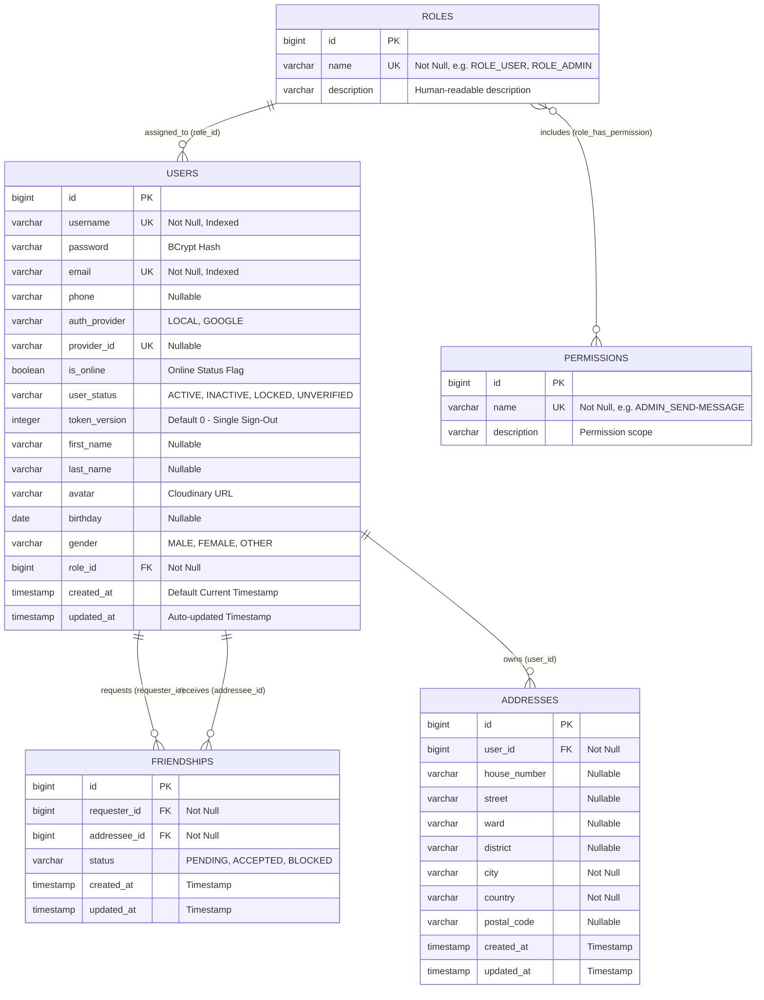

# Polyglot Database Design

This document details the data storage architecture of **ChatWeb** across its three dedicated persistence engines: **PostgreSQL (Relational)**, **MongoDB (Document Store)**, and **Redis Stack (In-Memory Data Structures & Filters)**.

---

## 1. Relational Tier: PostgreSQL (RDBMS)

PostgreSQL serves as the authoritative source of truth for user authentication, role-based access control (RBAC), friendship graphs, and address records.

### 1.1. Entity-Relationship Diagram (ERD)



### 1.2. Index Optimization Strategy
- **Table `users`**:
  - `idx_user_status` on `(user_status)`: Accelerates queries filtering active, locked, or unverified accounts.
  - `idx_user_role_id` on `(role_id)`: Speeds up authority loading during JWT authentication filter execution.
  - Unique B-Tree Indexes: `uk_users_username`, `uk_users_email`, `uk_users_provider_id`.
- **Table `friendships`**:
  - Unique Constraint `(requester_id, addressee_id)`: Prevents duplicate friendship requests.
  - Composite Index `idx_friendship_requester_status` on `(requester_id, status)`: Accelerates outgoing friend request lookups.
  - Composite Index `idx_friendship_addressee_status` on `(addressee_id, status)`: Accelerates incoming pending invitation lookups.
- **Table `addresses`**:
  - `idx_address_user_id` on `(user_id)`: Optimizes user address book queries.
- **Table `roles`**:
  - Unique Index on `name`.

---

## 2. Document Tier: MongoDB (NoSQL)

MongoDB stores unstructured, high-frequency chat messages, read receipts, and transient administrative broadcasts.

### 2.1. Collection `messages`

Stores one-on-one direct messages, attachments, and reaction metadata.

| Field Name | BSON Type | Constraints & Description |
| :--- | :--- | :--- |
| `_id` | `ObjectId / String` | Unique message identifier. |
| `conversationId` | `String` | Normalized deterministic ID: `{minUsername}_{maxUsername}` (e.g. `alice_bob`). |
| `sender` | `String` | Sender username. |
| `recipient` | `String` | Recipient username. |
| `content` | `String` | Message text content (null for pure media). |
| `contentType` | `String` (Enum) | `TEXT`, `IMAGE`, `VIDEO`, `FILE`. |
| `messageType` | `String` (Enum) | `CHAT`, `TYPING`. |
| `color` | `String` | Hex color code for customized chat bubble UI. |
| `replyToId` | `String` | `_id` of the quoted parent message (null if direct message). |
| `fileUrl` | `String` | Cloudinary CDN URL for media attachments. |
| `fileName` | `String` | Original filename of uploaded media. |
| `fileSize` | `Long` | File size in bytes. |
| `timestamp` | `Date / ISODate` | Message creation timestamp. |
| `status` | `String` (Enum) | `SENDING`, `SENT`, `READ`. |
| `isEdited` | `Boolean` | Flag indicating whether the message content has been edited. |
| `isDeleted` | `Boolean` | Soft-deletion flag (revoked message). |
| `isReacted` | `Boolean` | Flag indicating whether emoji reactions exist. |
| `reactions` | `Map<String, String>` | Key-value dictionary of reactions: `{ "username": "emoji" }`. |

#### Compound Indexes:
1. **`conv_msg_time_idx`**: `{ conversationId: 1, messageType: 1, timestamp: -1 }`  
   *Purpose*: High-speed cursor-based pagination of chat history in reverse chronological order.
2. **`unread_msg_idx`**: `{ recipient: 1, messageType: 1, isDeleted: 1, sender: 1 }`  
   *Purpose*: Fast aggregation and counting of unread messages grouped by sender.
3. **`conv_content_time_idx`**: `{ conversationId: 1, messageType: 1, isDeleted: 1, timestamp: -1 }`  
   *Purpose*: Full-text and keyword searching within active (non-deleted) conversation messages.
4. **`sender_idx`**: `{ sender: 1 }`  
   *Purpose*: Accelerates user activity and moderation queries.

---

### 2.2. Collection `read_receipts`

Implements monotonic watermark tracking for user read positions.

| Field Name | BSON Type | Constraints & Description |
| :--- | :--- | :--- |
| `_id` | `String` | Unique receipt identifier: `{conversationId}:{username}`. |
| `conversationId` | `String` | Canonical conversation identifier. |
| `username` | `String` | Reader username. |
| `lastReadTimestamp` | `Date / ISODate` | Monotonically updated read watermark timestamp. |

#### Indexes:
- **`conv_user_idx`**: `{ conversationId: 1, username: 1 }`, `unique: true`  
  Guarantees exactly one watermark record per user per conversation.
- **`conversationId_idx`**: `{ conversationId: 1 }`
- **`username_idx`**: `{ username: 1 }`

---

### 2.3. Collection `system_message`

Stores administrative broadcast announcements with automated lifecycle expiration.

| Field Name | BSON Type | Constraints & Description |
| :--- | :--- | :--- |
| `_id` | `String` | Unique announcement identifier. |
| `sender` | `String` | Admin username who published the announcement. |
| `content` | `String` | Broadcast message text. |
| `timestamp` | `Date / ISODate` | Publication timestamp. |
| `expiresAt` | `Date / ISODate` | Timestamp after which the announcement becomes obsolete. |

#### Time-To-Live (TTL) Index:
- **`expiresAt_ttl_idx`**: `{ expiresAt: 1 }`, `expireAfterSeconds: 0`  
  MongoDB background TTL thread automatically purges expired announcements without application intervention.

---

### 2.4. Automated MongoDB Initialization Script (`init-mongo.js`)

ChatWeb includes an automated JavaScript database initialization file mounted to `/docker-entrypoint-initdb.d/init-mongo.js:ro` in `docker-compose.yml`:

```javascript
const dbName = (typeof process !== 'undefined' && process.env && process.env.MONGO_DB) ? process.env.MONGO_DB : 'chatweb';
const targetDb = db.getSiblingDB(dbName);

// 1. messages collection & indexes
targetDb.createCollection('messages');
targetDb.messages.createIndex({ conversationId: 1, messageType: 1, timestamp: -1 }, { name: 'conv_msg_time_idx' });
targetDb.messages.createIndex({ recipient: 1, messageType: 1, isDeleted: 1, sender: 1 }, { name: 'unread_msg_idx' });
targetDb.messages.createIndex({ conversationId: 1, messageType: 1, isDeleted: 1, timestamp: -1 }, { name: 'conv_content_time_idx' });
targetDb.messages.createIndex({ sender: 1 }, { name: 'sender_idx' });

// 2. read_receipts collection & indexes
targetDb.createCollection('read_receipts');
targetDb.read_receipts.createIndex({ conversationId: 1, username: 1 }, { name: 'conv_user_idx', unique: true });
targetDb.read_receipts.createIndex({ conversationId: 1 }, { name: 'conversationId_idx' });
targetDb.read_receipts.createIndex({ username: 1 }, { name: 'username_idx' });

// 3. system_message collection & TTL index
targetDb.createCollection('system_message');
targetDb.system_message.createIndex({ expiresAt: 1 }, { name: 'expiresAt_ttl_idx', expireAfterSeconds: 0 });
```

---

## 3. In-Memory Tier: Redis Stack

Redis Stack serves as the ultra-fast distributed coordinating fabric across all backend instances.

### 3.1. Master Redis Key Catalog

| Key Pattern | Data Structure | TTL | Purpose & Usage |
| :--- | :--- | :--- | :--- |
| `online_users` | **Sorted Set (ZSet)** | Persistent | Holds usernames of currently online users. `score` = Epoch timestamp of latest ping/connect. |
| `online_users_count` | **Hash** | Persistent | Field: `username`, Value: integer count of active WebSocket tabs/sessions. |
| `presence:offline_queue` | **Sorted Set (ZSet)** | Transient | Distributed debounce queue. `score` = Epoch timestamp deadline (`now + 5000ms`). Polled by `SessionCleanupScheduler`. |
| `ws:routing:servers:{username}` | **Hash** | Persistent | Field: `serverId`, Value: active session count on that specific backend instance. |
| `channel:server:{serverId}` | **Pub/Sub Channel** | N/A (Stream) | Dedicated channel for cross-server WebSocket frame forwarding. |
| `ws:dedup:{sender}:{localId}` | **String** | **300 seconds** | Set via `SETNX`. Prevents duplicate STOMP message execution during network retries. |
| `chat:recent:hash:{convId}` | **Hash** | **24 hours** | Caches full metadata of the most recent message for fast conversation list rendering. |
| `chat:recent:zset:{convId}` | **Sorted Set (ZSet)** | **24 hours** | Stores recent message IDs with `score` = timestamp for fast message ID slicing. |
| `read:receipt:{convId}:{username}`| **String** | **7 days** | Caches latest read watermark timestamp for fast frontend synchronization. |
| `unread:counts:{username}` | **Hash / Key** | Evicted on read | Caches unread message counts per conversation. Evicted upon read receipt upsert. |
| `blacklist:{token}` | **String** | Remaining JWT TTL | Set upon logout to immediately invalidate unexpired JWT Access Tokens. |
| `rt:{token}` | **Serialized Object** | **7 days** | Stores `RefreshTokenData` (UUID, username, `tokenVersion`) for token rotation and validation. |
| `register:{email}` | **Serialized Object** | **5 minutes** | Temporary registration cache storing pending user details and verification OTP. |
| `filter:usernames` | **Cuckoo Filter** | Persistent | High-speed probabilistic filter checking if a username is already registered (`CF.EXISTS`). |
| `filter:emails` | **Cuckoo Filter** | Persistent | High-speed probabilistic filter checking if an email address is registered (`CF.EXISTS`). |
| `rate_limit:{key}` | **Sorted Set (ZSet)** | Window + 2s | Sliding Window Log rate limiter managed atomically via custom Lua scripts. |
| `idempotent:{key}:{idempotencyKey}`| **String** | **300–600 seconds**| Distributed lock preventing duplicate execution of sensitive REST endpoints (e.g. file upload). |
